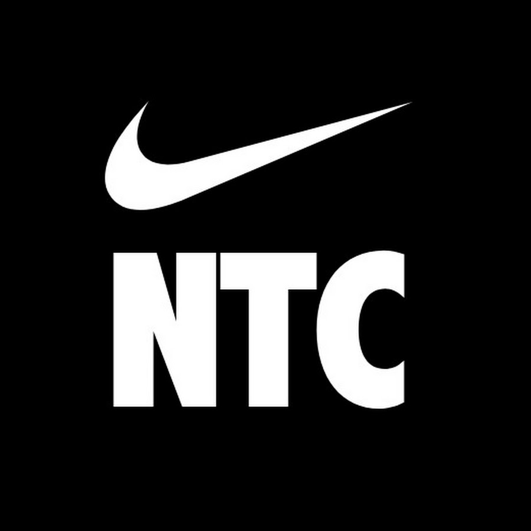
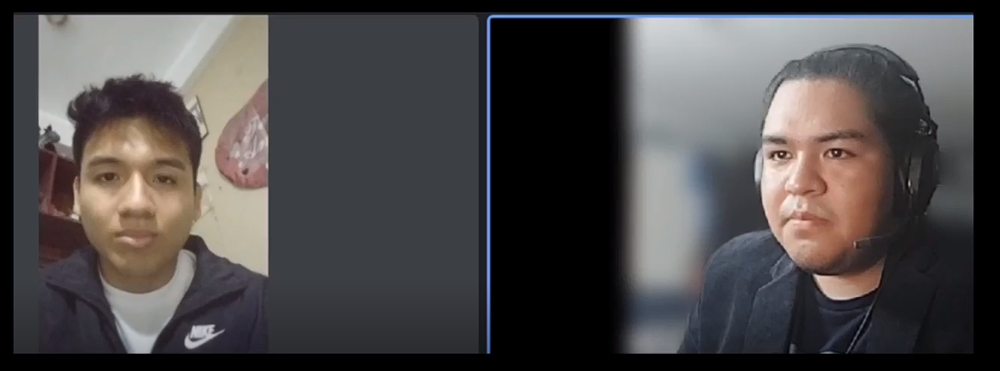
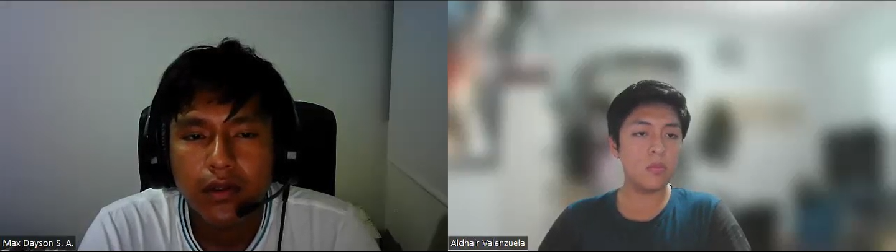
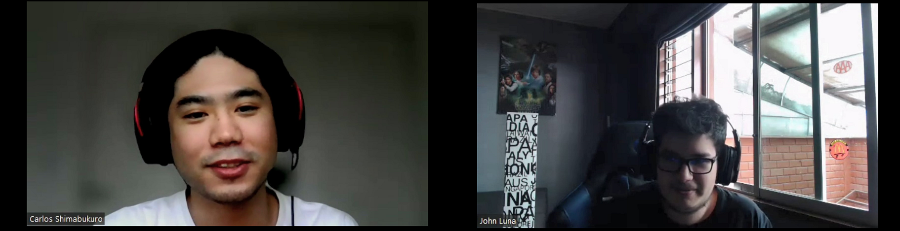
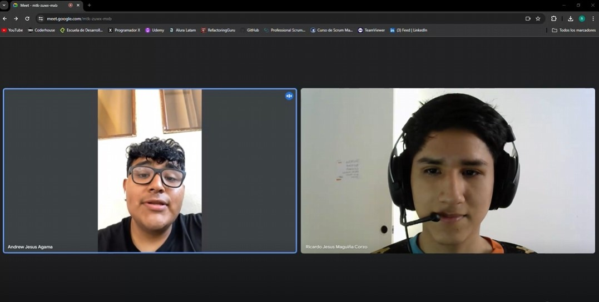
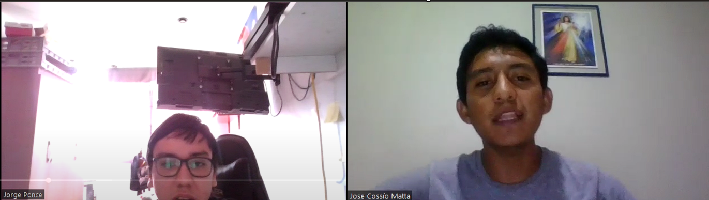

# Capítulo II: Requirements Elicitation & Analysis

## 2.1. Competidores
- - -
[
 ](https://www.myfitnesspal.com/es)

***MyFitnessPal:*** Es una de las aplicaciones líderes en el seguimiento de alimentos y ejercicio físico. Ofrece una amplia base de datos de alimentos y permite a los usuarios realizar un seguimiento de su ingesta calórica y actividad física para ayudarles a alcanzar sus objetivos de salud y fitness. Además del seguimiento básico, MyFitnessPal también proporciona herramientas para establecer metas personalizadas, crear planes de alimentación y recibir apoyo de una comunidad activa de usuarios.
- - -
[
 ](https://www.noom.com/es/blog/cuanto-cuesta-noom/)

***Noom:*** Es una aplicación de coaching en salud y bienestar que se centra en la pérdida de peso y el cambio de hábitos. Utiliza un enfoque basado en la psicología y la tecnología para ayudar a los usuarios a desarrollar hábitos saludables a largo plazo. Noom ofrece programas personalizados de pérdida de peso, seguimiento del progreso, educación sobre nutrición y ejercicio, así como apoyo de coaches certificados.
- - -
[
 ](https://www.nike.com/es/ntc-app)

***NikeTrainingClub:*** Es una aplicación de entrenamiento de Nike que ofrece una amplia variedad de programas de ejercicio, desde entrenamientos de fuerza hasta yoga y cardio. La aplicación incluye entrenamientos guiados por expertos, seguimiento del progreso y una comunidad activa de usuarios que comparten sus logros y motivan a otros. Además, Nike Training Club está integrado con dispositivos Nike y ofrece acceso exclusivo a contenido de entrenamiento de atletas y celebridades patrocinados por Nike.
- - -
### 2.1.1. Análisis Competitivo

**Competitive Analysis Landscape**

**¿Por qué llevar a cabo este análisis?**

El objetivo de este análisis es investigar a detalle las características principales y las propuestas de valor que ofrecen otras empresas que tienen el objetivo de brindar una solución a nuestra misma problemática. Así, podremos encontrar una forma viable y consistente con la que podremos diferenciarnos de ellos.

###### Tabla 2.
Análisis Competitivo organizado para todos los competidores potenciales de FitHub.

|                         | Empresas                     | FitHub                                                                                                                                                                                  | MyFitnessPal                                                                                                                                                       | Noom                                                                                                                                                                    | NikeTrainingClub                                                                                                                                                   |
|-------------------------|------------------------------|-----------------------------------------------------------------------------------------------------------------------------------------------------------------------------------------|--------------------------------------------------------------------------------------------------------------------------------------------------------------------|-------------------------------------------------------------------------------------------------------------------------------------------------------------------------|--------------------------------------------------------------------------------------------------------------------------------------------------------------------|
| **Perfil**              | **Overview**                 | Una aplicación móvil y web que ofrece coaching personalizado, seguimiento de progreso y planes de ejercicio y alimentación adaptados a las necesidades individuales de los usuarios.			 | Una aplicación líder en seguimiento de alimentos y ejercicio, con una amplia base de usuarios y herramientas para ayudar a mejorar la salud y el estado físico.			 | Una aplicación de coaching en salud y bienestar que combina seguimiento de alimentos, planificación de comidas, apoyo de coaching y educación sobre hábitos saludables. | Una aplicación de entrenamiento de Nike que ofrece una amplia variedad de programas de ejercicio, entrenamientos guiados por expertos y seguimiento del progreso.	 |
|                         | **Ventaja competitiva**      | Ofrece coaching personalizado y seguimiento de progreso integral para una experiencia de usuario altamente adaptada.			                                                                 | Amplia base de usuarios, base de datos extensa de alimentos, integración con dispositivos de fitness y una comunidad activa.	                                      | Enfoque holístico en la salud y el bienestar, coaching personalizado, educación sobre hábitos saludables y seguimiento del progreso.                                    | Variedad de entrenamientos y programas, consejos y guía de entrenadores expertos, seguimiento del progreso detallado y amplia integración con dispositivos Nike.   |
| **Perfil de Marketing** | **Mercado Objetivo**         | Individuos interesados en mejorar su salud y condición física, así como profesionales del coaching en áreas como el ejercicio y la nutrición.                                           | Personas que buscan mejorar su dieta y actividad física, así como profesionales de la salud y el fitness.                                                          | Usuarios interesados en una experiencia de coaching en línea centrada en la salud y el bienestar, con un enfoque en la educación y el apoyo personalizado.              | Individuos que buscan variedad en sus entrenamientos, guía de expertos y seguimiento del progreso para mejorar su estado físico.                                   |
|                         | **Estrategias de Marketing** | Marketing digital dirigido a individuos interesados en la salud y el bienestar, así como colaboraciones con profesionales del sector.                                                   | Marketing de contenido, integración con dispositivos de fitness y una sólida presencia en línea.                                                                   | Enfoque en la educación sobre hábitos saludables, coaching personalizado y testimonios de éxito.                                                                        | Promoción de la marca Nike, colaboraciones con atletas y celebridades, y marketing digital dirigido a entusiastas del fitness.                                     |
| **Perfil de Producto**  | **Productos y Servicios**    | Aplicación web con coaching personalizado, seguimiento de progreso y planes de ejercicio y alimentación adaptados.                                                                      | Aplicación móvil y web con seguimiento de alimentos, registro de ejercicio, objetivos personalizables y comunidad en línea.                                        | Aplicación móvil que combina seguimiento de alimentos, planificación de comidas, apoyo de coaching y educación sobre hábitos saludables.                                | Aplicación móvil con una amplia variedad de programas de ejercicio, entrenamientos guiados por expertos y seguimiento del progreso.                                |
|                         | **Precios y Costos**         | Modelo de suscripción mensual para acceder a los servicios de coaching y planes alimentarios personalizados.                                                                            | Modelo gratuito con opciones premium de suscripción mensual o anual.                                                                                               | Modelo de suscripción con opciones de pago mensual o anual.                                                                                                             | Modelo gratuito con opciones de suscripción premium disponibles.                                                                                                   |
|                         | **Canales de Distribución**  | Disponible en línea a través de la aplicación móvil y la plataforma web.                                                                                                                | Disponible en línea a través de la aplicación móvil y la plataforma web.                                                                                           | Disponible en línea a través de la aplicación móvil y la plataforma web.                                                                                                | Disponible en línea a través de la aplicación móvil y la plataforma web.                                                                                           |
| **Análisis SWOT**       | **Fortalezas**               | Coaching personalizado  Seguimiento de progreso integral  Planes de ejercicio y alimentación adaptados                                                                      | Amplia base de usuarios  Base de datos extensa de alimentos  Comunidad activa                                                                          | Enfoque holístico en la salud y el bienestar  Coaching personalizado  Educación sobre hábitos saludables                                                    | Variedad de entrenamientos y programas  Consejos y guía de entrenadores expertos  Seguimiento del progreso detallado                                   |
|                         | **Debilidades**              | Novedad en el mercado  Confianza en las empresas educativas                                                                                                                       | Precio prohibitivo (facturado anualmente)  Solo disponible en inglés                                                                                         | Precio variable (en función de la inscripción de niños)  Material muy general                                                                                     | Precio alto (facturado anualmente)  Enfoque en niños de entre 3 a 10 años                                                                                    |
|                         | **Oportunidades**            | Expansión a nivel internacional  Establecer asociaciones con empresas educativas                                                                                                  | Precios basados en el nivel socioeconómico  Posibilidad de cambio de idioma                                                                                  | Precios fijos basados en usuario  Actualización continua del material                                                                                             | Precios basados en el nivel socioeconómico  Optimización del rendimiento de la aplicación web                                                                |
|                         | **Amenazas**                 | Competidores establecidos  Aceptación por parte de empresas educativas                                                                                                            | Competencia de aplicaciones similares  Precio alto (facturado anualmente)                                                                                    | Competencia de aplicaciones similares  Precio variable                                                                                                            | Competencia de aplicaciones similares  Precio alto (facturado anualmente)                                                                                    |

### 2.1.2. Estrategias y tácticas frente a competidores

1.  **Desarrollar una Propuesta de Valor Única :**
    * Estrategia: Destacar los aspectos únicos y diferenciadores de nuestro producto que lo hacen sobresalir frente a la competencia.
    * Táctica: Identificar las fortalezas clave de nuestro producto, como el enfoque holístico en la salud y el bienestar, y comunica claramente cómo benefician a los usuarios.
2.  **Enfoque en la Experiencia del Usuario :**
    * Estrategia: Priorizar la satisfacción y la experiencia del usuario para generar lealtad a la marca.
    * Táctica: Mejorar continuamente la interfaz de usuario de nuestro aplicación, simplificando la navegación y agregando funciones que faciliten el uso y la comprensión.
3.  **Ampliar la Base de Usuarios:**
    * Estrategia: Atraer a más usuarios a nuestra plataforma para aumentar su visibilidad y relevancia en el mercado.
    * Táctica: Implementar programas de referidos y promociones para incentivar a los usuarios actuales a invitar a amigos y familiares a unirse a nuestra aplicación.
4.  **Ampliar la Base de Usuarios:**
    * Estrategia: Destacar la capacidad de nuestro producto para adaptarse a las necesidades individuales de cada usuario.
    * Táctica: Ofrecer opciones de personalización en los planes de ejercicio y alimentación, así como seguimiento de progreso y recomendaciones adaptadas a los objetivos y preferencias de cada usuario.
5.  **Marketing Digital Dirigido:**
    * Estrategia: Dirigir nuestros esfuerzos de marketing digital hacia los segmentos de mercado más relevantes y receptivos.
    * Táctica: Utilizar estrategias de segmentación de audiencia en plataformas como redes sociales y motores de búsqueda para llegar a usuarios interesados en mejorar su salud y condición física.
6.  **Colaboraciones Estratégicas:**
    * Estrategia: Establecer asociaciones con otras empresas o profesionales del sector para expandir nuestro alcance y credibilidad.
    * Táctica: Colaborar con nutricionistas, entrenadores personales o influencers en el ámbito del fitness para promocionar unestro producto y llegar a nuevas audiencias.

---

## 2.2. Entrevistas

### 2.2.1. Diseño de entrevistas
* **Individuos interesados en mejorar su salud y condición física:**
1. ¿Qué te ha motivado a buscar maneras de mejorar tu salud y condición física en este momento?
2. ¿Cuál ha sido tu experiencia previa al intentar adoptar un estilo de vida más saludable? ¿Qué obstáculos has enfrentado?
3. ¿Qué tipo de apoyo o orientación te resultaría más útil para alcanzar tus objetivos de salud y condición física?
4. ¿Cómo crees que una Aplicación web de coaching en línea podría ayudarte a mantenerte motivado y comprometido con tus metas de bienestar?
5. ¿Qué características considerarías más importantes al elegir un servicio de coaching en línea para ayudarte a alcanzar tus objetivos de salud y condición física?
6. ¿Qué esperas obtener de un coach profesional en términos de apoyo y seguimiento en tu viaje hacia un estilo de vida más saludable?

* **Profesionales del coaching en ejercicio y alimentación:**
1. ¿Qué te llevó a convertirte en un profesional del coaching en ejercicio o alimentación?
2. ¿Cuáles son los mayores desafíos que enfrentas al trabajar con clientes de manera presencial?
3. ¿Qué beneficios ves en la posibilidad de ofrecer servicios de coaching en línea?
4. ¿Qué herramientas o características crees que serían más útiles para ti al proporcionar servicios de coaching en línea a tus clientes?
5. ¿Qué aspectos considerarías críticos al seleccionar una plataforma de coaching en línea para ofrecer tus servicios profesionales?
6. ¿Cómo crees que una aplicación web de coaching  podría mejorar la eficacia de tu trabajo como coach y la experiencia de tus clientes?

### 2.2.2. Registro de entrevistas

**Entrevista N°1:**
###### Figura 1
  

**Datos principales:**  
- Nombre y apellidos: Diego Paulino  
- Edad: 21 años  
- Distrito: Santiago de Surco  
- Link: [URL de entrevista](https://upcedupe-my.sharepoint.com/:v:/g/personal/u202012207_upc_edu_pe/ER7KWELuwWdJuOSis4APNUkBSVkiFUD3YuwMhxMEicLYZw?e=sLI70y&nav=eyJyZWZlcnJhbEluZm8iOnsicmVmZXJyYWxBcHAiOiJTdHJlYW1XZWJBcHAiLCJyZWZlcnJhbFZpZXciOiJTaGFyZURpYWxvZy1MaW5rIiwicmVmZXJyYWxBcHBQbGF0Zm9ybSI6IldlYiIsInJlZmVycmFsTW9kZSI6InZpZXcifX0%3D)
- Inicio De Entrevista: 0:10  
- Duración: 3:12  

**Transcripción de la entrevista:**  
El entrevistado revela una motivación actual para mejorar su salud y condición física, destacando su interés en adoptar un estilo de vida más activa y organizada. Su experiencia previa incluye intentos anteriores de seguir una dieta equilibrada y hacer ejercicio regularmente, pero ha enfrentado desafíos como la falta de organización y la dificultad para mantener la consistencia. Busca un apoyo y orientación útiles para alcanzar sus objetivos, priorizando la educación sobre nutrición y la planificación de comidas saludables. Considera que una Aplicación web de coaching en línea sería beneficiosa por su accesibilidad y seguimiento del progreso. Al elegir un servicio de coaching, valora la personalización de los planes, el apoyo constante y la motivación para mantenerse comprometido con sus objetivos. Espera recibir un apoyo profesional y personalizado de un coach en su viaje hacia un estilo de vida más saludable.

- - -

**Entrevista N°2:**
###### Figura 2
  
**Datos principales:**
- Nombre completo del entrevistado: Max Sabino
- Edad: 22
- Distrito: Chorrillos
- Link:[URL de entrevista](https://upcedupe-my.sharepoint.com/:v:/g/personal/u20201f572_upc_edu_pe/EQFNdbQMhnlCiN18bVwSitYBNew8OTVQH3NDFTABv3Gw4A?e=BhLUF1)
- Inicio de la entrevista: 00:05
- Duración: 05:34

**Transcripción de la entrevista:**  
En la entrevista con Max Sabino, un estudiante universitario de 22 años, se evidencia su fuerte motivación por mejorar su salud y condición física debido al aumento de peso y el sedentarismo. Max reconoce obstáculos como la falta de motivación y disciplina, pero muestra una actitud proactiva al buscar apoyo de un coach con experiencia en salud física, seguimiento regular y establecimiento de metas personalizadas. Destaca la importancia del trato y la exigencia del coach, demostrando su compromiso serio con adoptar un estilo de vida más saludable y su disposición a trabajar para alcanzar sus objetivos.

- - -

**Entrevista N°3:**
###### Figura 3
  
**Datos principales:**
- Nombre completo del entrevistado: Valeria Makino
- Edad: 20
- Distrito: Lima
- Link:[URL de entrevista](https://upcedupe-my.sharepoint.com/:v:/g/personal/u201912407_upc_edu_pe/Ec6MBwEXcG9NhIrsjLWVqNoBHEKp97zoRreYc8x8Xl2utQ?e=8JvAba&nav=eyJyZWZlcnJhbEluZm8iOnsicmVmZXJyYWxBcHAiOiJTdHJlYW1XZWJBcHAiLCJyZWZlcnJhbFZpZXciOiJTaGFyZURpYWxvZy1MaW5rIiwicmVmZXJyYWxBcHBQbGF0Zm9ybSI6IldlYiIsInJlZmVycmFsTW9kZSI6InZpZXcifX0%3D)
- Inicio de la entrevista: 00:05
- Duración: : 06:58

**Transcripción de la entrevista:**  
En esta entrevista se puede resaltar que, la entrevistada es una estudiante que tras recuperarse de una lesión en la rodilla se sintió en la necesidad de mantener una rutina de ejercicios a modo de rehabilitación. Sin embargo, al comenzar con los ejercicios ha notado que le cuesta ser constante. Por lo que le entusiasma la idea que presenta Fithub y nos proporciona su opinión y lo que le gustaría que NutriTech ofrezca a sus usuarios.

- - -

**Entrevista N°4:**
###### Figura 4
  
**Datos principales:**
- Nombre completo del entrevistado: John Luna
- Edad: 26
- Distrito: Lima
- Link:[URL de entrevista](https://upcedupe-my.sharepoint.com/:v:/g/personal/u201912407_upc_edu_pe/ESyMIxvtS3BLsPtfUMgAIzEBt2mJ6yur88RVA29MaoU_eA?e=XKpvwF&nav=eyJyZWZlcnJhbEluZm8iOnsicmVmZXJyYWxBcHAiOiJTdHJlYW1XZWJBcHAiLCJyZWZlcnJhbFZpZXciOiJTaGFyZURpYWxvZy1MaW5rIiwicmVmZXJyYWxBcHBQbGF0Zm9ybSI6IldlYiIsInJlZmVycmFsTW9kZSI6InZpZXcifX0%3D)
- Inicio de la entrevista: 00:05
- Duración: 04:22

**Transcripción de la entrevista:**  
En esta entrevista se puede resaltar que, el entrevistado es un coach profesional que le apasiona los deportes, el ejercicio y la nutrición. Menciona que el tiempo y los horarios son unos factores que dificultan proveer los servicios de forma presencial. Además, de las largas distancias que maneja entre él y sus clientes, que afecta negativamente el desarrollo de su trabajo. Por último, mostró bastante interés en la capacidad de FitHub de facilitar el seguimiento de los clientes mediante los reportes de rutinas. 

---

**Entrevista N°5:**
###### Figura 5
  
**Datos principales:**
- Nombre completo del entrevistado: Andrew Agama
- Edad: 24
- Distrito: Lima
- Link:[URL de entrevista](https://upcedupe-my.sharepoint.com/:v:/g/personal/u202121858_upc_edu_pe/EbvDMBCSMeNKuZnzAYFdW1UBLLacjGEKcu3-oFyjbMbuvA?e=9hXutF&nav=eyJyZWZlcnJhbEluZm8iOnsicmVmZXJyYWxBcHAiOiJTdHJlYW1XZWJBcHAiLCJyZWZlcnJhbFZpZXciOiJTaGFyZURpYWxvZy1MaW5rIiwicmVmZXJyYWxBcHBQbGF0Zm9ybSI6IldlYiIsInJlZmVycmFsTW9kZSI6InZpZXcifX0%3D)
- Inicio de la entrevista: 00:02
- Duración: 02:23

**Transcripción de la entrevista:**  
Conversamos con un apasionado profesional del coaching en ejercicio y alimentación. Su motivación inicial fue la pasión por el bienestar y la salud. En el trabajo presencial, los desafíos principales son la adaptación a necesidades individuales y la motivación constante de los clientes. Sin embargo, ve grandes beneficios en ofrecer servicios en línea, como la accesibilidad global y la flexibilidad de horarios. Para mejorar la eficacia en línea, considera herramientas como mensajería, recursos educativos, seguimiento de progreso y videoconferencias. Al seleccionar una plataforma de coaching en línea, prioriza la seguridad de datos, facilidad de uso y opciones de pago seguras. Además, una aplicación web de coaching podría mejorar la experiencia mediante seguimiento personalizado y acceso a recursos educativos adicionales, así como recordatorios automáticos para los clientes. 

---

**Entrevista N°6:**
###### Figura 6
   
**Datos principales:**
- Nombre completo del entrevistado: Jose Cossio Matta
- Edad: 22
- Distrito: Ica
- Link: [URL de entrevista](https://upcedupe-my.sharepoint.com/:v:/g/personal/u202120471_upc_edu_pe/EYyl_Hf8WaRLomRT6Y4l6ucBLsZm1ZgWV4fZmbzVLj0R2Q?e=7bbDv4&nav=eyJyZWZlcnJhbEluZm8iOnsicmVmZXJyYWxBcHAiOiJTdHJlYW1XZWJBcHAiLCJyZWZlcnJhbFZpZXciOiJTaGFyZURpYWxvZy1MaW5rIiwicmVmZXJyYWxBcHBQbGF0Zm9ybSI6IldlYiIsInJlZmVycmFsTW9kZSI6InZpZXcifX0%3D)
- Inicio de la entrevista: 00:05
- Duración: 11:35

**Transcripción de la entrevista:**  
Conversamos con un profesional en nutrición. Su motivación inicial fue por ayudar a su abuela y de ahi nació la motivación de ayudar a los demás. En el trabajo presencial, los desafíos principales son el tiempo y la locación. Sin embargo, ve grandes beneficios en ofrecer servicios en línea, como la accesibilidad, la flexibilidad de horarios, el ahorro de tiempo y costos. Para mejorar la eficacia en línea, considera herramientas como seguimiento de progreso y videoconferencias. Al seleccionar una plataforma de coaching en línea, prioriza la seguridad de datos, costo estandarizado, facilidad de uso y flexibilidad de horarios. Además, una aplicación web de coaching podría mejorar la experiencia mediante seguimiento constante del progreso, feedback y comunicación contínua, así como facilidad para distribuir material educativo de calidad. 

### 2.2.3. Análisis de entrevistas

**Segmento 1 - Individuos interesados en mejorar su salud y condición física:** 
Las tres entrevistas muestran que todos quieren mejorar su salud y estado físico, pero cada uno tiene su historia única. Diego, Max y Valeria están todos buscando un empujón extra para lograr sus objetivos. Les importa mucho recibir consejos personalizados, aprender más sobre alimentación y tener alguien que los anime constantemente. Todos piensan que una aplicación de coaching en línea sería genial para mantenerlos en el camino correcto. Aunque, cada uno ha tenido sus propios desafíos, como la falta de motivación o la dificultad para mantenerse constante. Aprecian mucho cuando el coach se toma el tiempo para tratarlos de manera individual y los desafía a seguir adelante. En conclusión, queda claro que ofrecer un servicio de coaching en línea que se adapte a las necesidades únicas de cada persona es clave para ayudarlos a alcanzar sus metas de salud y estado físico.

**Segmento 2 - Profesionales del coaching en ejercicio y alimentación:**

Las entrevistas revelan que los profesionales del coaching en ejercicio y alimentación enfrentan dificultades al trabajar en persona debido a los horarios ajustados y las distancias geográficas. Sin embargo, están entusiasmados con la idea del coaching en línea, ya que les brinda la oportunidad de superar estas barreras y hacer que sus servicios sean más accesibles para una audiencia más amplia. Consideran que herramientas como el seguimiento del progreso son fundamentales para el éxito de sus servicios en línea, ya que les permiten mantenerse al tanto del progreso de sus clientes y ajustar sus planes en consecuencia. Además, la seguridad de los datos es una preocupación importante para ellos al elegir una plataforma en línea, ya que desean garantizar la confidencialidad y privacidad de la información de sus clientes. En cuanto a las aplicaciones web de coaching, creen que podrían mejorar significativamente la experiencia del cliente al proporcionar un seguimiento más constante del progreso, una comunicación más fluida y acceso a recursos educativos adicionales. En conclusión, están entusiasmados con las posibilidades que ofrece el coaching en línea y están comprometidos a aprovechar al máximo estas herramientas para brindar un servicio excepcional a sus clientes.

## 2.3. Needfinding

### 2.3.1. User Personas

###### USER PERSONA 1.

###### USER PERSONA 2.

### 2.3.2. User Task Matrix

###### Tabla 3.

Modelo de User Task Matrix definido para los dos user persona seleccionados.

| Tareas |  U1: Ana García  |      |  U2: Carlos Martínez  |      |
|-------|------|------|------|------|
| | Frecuencia | Importancia | Frecuencia | Importancia |
| Planificación de comidas saludables		 |Often | High|Rarely | High|
| Seguimiento de rutinas de ejercicio |Often |High | Often|High |
|Investigación de nuevas técnicas de entrenamiento | Sometimes| High| Often|High |
|Acceso a contenido educativo	 |Often |High | Often|High |
|Revisión de progreso y estadísticas	 | Often |High | Often|High |
|Participación en comunidades en línea |Sometimes |Medium |Sometimes |High |
|Establecimiento de metas de bienestar |Often |High | Often|High |
|Gestión del tiempo para ejercitar |Often |High |Sometimes|High |

### 2.3.3. User Journey Mapping

###### Figura 7.

### 2.3.4. Empathy Mapping
###### Figura 9.

### 2.3.5. As-is Scenario Mapping

* **Mapa de Escenario As-Is para nuestro primer user persona.**
###### Tabla 4.
|  Fases  | Busca información sobre rutinas de ejercicio. | Sigue una rutina especifica, seleccionada para sus objetivos. | Busca la ayuda de un coach profesional. | Entrena con la guía del coach profesional elegido. |
|--------|----|----|----|----|
|  Doing  | El usuario pregunta a sus amistades acerca de consejos para iniciar una rutina. Busca en internet diferentes rutinas que les sea útil. | Se plantea una meta en un periodo de tiempo. Crea un plan de entrenamiento que se ajuste a sus horarios. Genera memos que lo ayuden a observar el progreso que realiza. | Visita el gimnasio de su localidad para contactar con algún coach. Busca en redes sociales diferentes coaches cerca de su ubicación. | Contacta con su coach. Acuerdan días de entrenamiento presenciales.Seleccionan un lugar de encuentro en una ubicación intermedia. Recibe las instrucciones del coach para llevar un registro de su entrenamiento.
|  Thinking  | ¿Qué tipos de rutinas habrá? ¿Mis amigos conocerán algunas rutinas efectivas? ¿En qué paginas podre buscar esta información? ¿Hay mucha información cuáles serán las más importantes? | ¿Esta rutina será la correcta? ¿Cómo será la manera correcta de hacer este ejercicio? ¿Podre mantenerme constante con el entrenamiento? | ¿Habrá alguien adecuado que me pueda ayudar? ¿En donde seria bueno encontrar a un coach ¿Cuánto costara trabajar con un coach profesional? | ¿Nuestros horarios coincidirán? ¿Mi coach estará registrando mi progreso de manera adecuada? 
|  Feeling  | Desconcertado por la falta de conocimientos en el tema. Perdido debido a la gran cantidad de información en internet. | Preocupado con la correcta forma de seguir la rutina. | Desconfiado al no conocer previamente a los coaches. | Intranquilidad por la nueva rutina y forma de seguir con los ejercicios. Además de el cambio presentado por recibir el apoyo del coach.

---

* **Mapa de Escenario As-Is para nuestro segundo user persona.**
###### Tabla 5.
|  Fases  | Busca clientes interesados en el entrenamiento físico y nutrición.  | Diseñar las rutinas de los clientes  | Llevar el registro del progreso realizado por el cliente | Acordar entrenamientos personales entre él y el cliente. |
|--------|----|----|----|----|
|  Doing  | Publicita sus servicios en redes sociales. Visita gimnasios locales para contactar con posibles clientes. | Escucha las metas y peticiones del cliente. Selecciona los ejercicios que ayudaran al cliente. Planea una rutina personalizada basada en cada cliente. | Elige una herramienta en la que pueda llevar la contabilidad de cada cliente. Ingresa actualizaciones acerca de cada mejora que tiene el cliente. | Acuerda la hora y el lugar de encuentro con el cliente. Organiza su horario para llevar a cabo cada sesión con los clientes. Se transporta hasta el lugar de encuentro.
|  Thinking  | ¿En dónde podré anunciar mis servicios de coaching? ¿Cuánto alcance podré lograr con los métodos que estoy siguiendo? | ¿El cliente se sentirá cómodo con esta rutina? ¿Cuán especifico debería seleccionar los ejercicios? | ¿Qué herramienta será la más eficiente? ¿Esta herramienta será confiable? ¿Estaré olvidando algún detalle importante? | ¿Tendré tiempo libre en mi horario? ¿Qué tal lejos se encontrará el cliente? ¿en dónde sería mejor encontrarme con el cliente?
|  Feeling  | Inseguro sobre el alcance que pueda conseguir con los métodos tradicionales que está empleando. | Duda acerca de las preferencias del cliente. Además, de la mejor forma de planificar la rutina. | Reflexivo debido a la seguridad de los datos ingresados sobre el cliente y su progreso. | Nervioso por encontrase con el cliente y por saber si lograran encontrar un punto intermedio de encuentro.

---

## 2.4. Ubiquitous Language

El lenguaje ubicuo, o "Ubiquitous Language", es un enfoque estructurado y definido para el modelo de dominio en un proyecto. Es un conjunto de términos y conceptos compartidos y entendidos por todos los miembros del equipo, incluyendo desarrolladores, stakeholders y expertos en el dominio. Facilita la comunicación y comprensión del negocio al establecer un vocabulario común que permite una discusión clara y precisa sobre los aspectos del proyecto, asegurando que todos estén en la misma página y contribuyan de manera efectiva al desarrollo y éxito del proyecto (Chandrasekaran, 2022).

- Coach: Profesional o experto en salud y fitness que brinda asesoramiento y apoyo a los usuarios a través de la aplicación.
- Perfil: información personal y las preferencias de cada usuario, incluyendo datos como edad, género, objetivos de salud, historial médico, etc.
- Plan de Entrenamiento: Una serie de ejercicios, actividades y metas diseñadas específicamente para cada usuario según sus objetivos y nivel de condición física.
- Plan Nutricional: Un conjunto de recomendaciones dietéticas y pautas alimenticias adaptadas a las necesidades y preferencias de cada usuario.
- Seguimiento de Progreso: Herramientas y funcionalidades para que los usuarios registren y monitoreen su progreso en términos de entrenamiento, dieta, peso, medidas corporales, etc.
- Recomendaciones Personalizadas: Sugerencias y consejos adaptados a cada usuario basados en su rendimiento, preferencias y objetivos.
- Logros: Hitos o metas alcanzadas por los usuarios en su camino hacia un estilo de vida más saludable.
- Gamificación: La integración de elementos lúdicos como desafíos, logros, puntos y recompensas para motivar y comprometer a los usuarios.
- Notificaciones: Mensajes y alertas automáticas que informan a los usuarios sobre nuevos logros, recordatorios de entrenamiento, consejos nutricionales, etc.
- Soporte: Servicio de atención al cliente y asistencia técnica ofrecido a los usuarios para resolver problemas, responder preguntas y brindar orientación.
- Suscripción: Opciones de membresía o planes de pago que los usuarios pueden elegir para acceder a funciones premium y contenido exclusivo.

---
