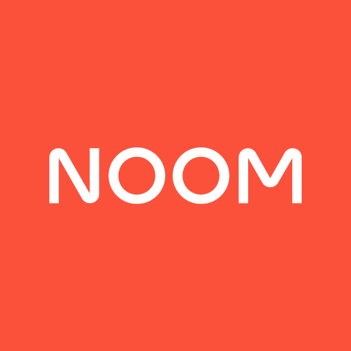

# Capítulo II: Requirements Elicitation & Analysis

## 2.1. Competidores

## 2.1. Competidores
- - -
[
 ](https://www.myfitnesspal.com/es)

***MyFitnessPal:*** Es una de las aplicaciones líderes en el seguimiento de alimentos y ejercicio físico. Ofrece una amplia base de datos de alimentos y permite a los usuarios realizar un seguimiento de su ingesta calórica y actividad física para ayudarles a alcanzar sus objetivos de salud y fitness. Además del seguimiento básico, MyFitnessPal también proporciona herramientas para establecer metas personalizadas, crear planes de alimentación y recibir apoyo de una comunidad activa de usuarios.
- - -
[
 ](https://www.noom.com/es/blog/cuanto-cuesta-noom/)

***Noom:*** Es una aplicación de coaching en salud y bienestar que se centra en la pérdida de peso y el cambio de hábitos. Utiliza un enfoque basado en la psicología y la tecnología para ayudar a los usuarios a desarrollar hábitos saludables a largo plazo. Noom ofrece programas personalizados de pérdida de peso, seguimiento del progreso, educación sobre nutrición y ejercicio, así como apoyo de coaches certificados.
- - -
[
 ](https://www.nike.com/es/ntc-app)

***NikeTrainingClub:*** Es una aplicación de entrenamiento de Nike que ofrece una amplia variedad de programas de ejercicio, desde entrenamientos de fuerza hasta yoga y cardio. La aplicación incluye entrenamientos guiados por expertos, seguimiento del progreso y una comunidad activa de usuarios que comparten sus logros y motivan a otros. Además, Nike Training Club está integrado con dispositivos Nike y ofrece acceso exclusivo a contenido de entrenamiento de atletas y celebridades patrocinados por Nike.
- - -
### 2.1.1. Análisis Competitivo

**Competitive Analysis Landscape**

**¿Por qué llevar a cabo este análisis?**

El objetivo de este análisis es investigar a detalle las características principales y las propuestas de valor que ofrecen otras empresas que tienen el objetivo de brindar una solución a nuestra misma problemática. Así, podremos encontrar una forma viable y consistente con la que podremos diferenciarnos de ellos.

###### Tabla 2.
Análisis Competitivo organizado para todos los competidores potenciales de FitHub.

|                         | Empresas                     | FitHub                                                                                                                                                                                  | MyFitnessPal                                                                                                                                                       | Noom                                                                                                                                                                    | NikeTrainingClub                                                                                                                                                   |
|-------------------------|------------------------------|-----------------------------------------------------------------------------------------------------------------------------------------------------------------------------------------|--------------------------------------------------------------------------------------------------------------------------------------------------------------------|-------------------------------------------------------------------------------------------------------------------------------------------------------------------------|--------------------------------------------------------------------------------------------------------------------------------------------------------------------|
| **Perfil**              | **Overview**                 | Una aplicación móvil y web que ofrece coaching personalizado, seguimiento de progreso y planes de ejercicio y alimentación adaptados a las necesidades individuales de los usuarios.			 | Una aplicación líder en seguimiento de alimentos y ejercicio, con una amplia base de usuarios y herramientas para ayudar a mejorar la salud y el estado físico.			 | Una aplicación de coaching en salud y bienestar que combina seguimiento de alimentos, planificación de comidas, apoyo de coaching y educación sobre hábitos saludables. | Una aplicación de entrenamiento de Nike que ofrece una amplia variedad de programas de ejercicio, entrenamientos guiados por expertos y seguimiento del progreso.	 |
|                         | **Ventaja competitiva**      | Ofrece coaching personalizado y seguimiento de progreso integral para una experiencia de usuario altamente adaptada.			                                                                 | Amplia base de usuarios, base de datos extensa de alimentos, integración con dispositivos de fitness y una comunidad activa.	                                      | Enfoque holístico en la salud y el bienestar, coaching personalizado, educación sobre hábitos saludables y seguimiento del progreso.                                    | Variedad de entrenamientos y programas, consejos y guía de entrenadores expertos, seguimiento del progreso detallado y amplia integración con dispositivos Nike.   |
| **Perfil de Marketing** | **Mercado Objetivo**         | Individuos interesados en mejorar su salud y condición física, así como profesionales del coaching en áreas como el ejercicio y la nutrición.                                           | Personas que buscan mejorar su dieta y actividad física, así como profesionales de la salud y el fitness.                                                          | Usuarios interesados en una experiencia de coaching en línea centrada en la salud y el bienestar, con un enfoque en la educación y el apoyo personalizado.              | Individuos que buscan variedad en sus entrenamientos, guía de expertos y seguimiento del progreso para mejorar su estado físico.                                   |
|                         | **Estrategias de Marketing** | Marketing digital dirigido a individuos interesados en la salud y el bienestar, así como colaboraciones con profesionales del sector.                                                   | Marketing de contenido, integración con dispositivos de fitness y una sólida presencia en línea.                                                                   | Enfoque en la educación sobre hábitos saludables, coaching personalizado y testimonios de éxito.                                                                        | Promoción de la marca Nike, colaboraciones con atletas y celebridades, y marketing digital dirigido a entusiastas del fitness.                                     |
| **Perfil de Producto**  | **Productos y Servicios**    | Aplicación web con coaching personalizado, seguimiento de progreso y planes de ejercicio y alimentación adaptados.                                                                      | Aplicación móvil y web con seguimiento de alimentos, registro de ejercicio, objetivos personalizables y comunidad en línea.                                        | Aplicación móvil que combina seguimiento de alimentos, planificación de comidas, apoyo de coaching y educación sobre hábitos saludables.                                | Aplicación móvil con una amplia variedad de programas de ejercicio, entrenamientos guiados por expertos y seguimiento del progreso.                                |
|                         | **Precios y Costos**         | Modelo de suscripción mensual para acceder a los servicios de coaching y planes alimentarios personalizados.                                                                            | Modelo gratuito con opciones premium de suscripción mensual o anual.                                                                                               | Modelo de suscripción con opciones de pago mensual o anual.                                                                                                             | Modelo gratuito con opciones de suscripción premium disponibles.                                                                                                   |
|                         | **Canales de Distribución**  | Disponible en línea a través de la aplicación móvil y la plataforma web.                                                                                                                | Disponible en línea a través de la aplicación móvil y la plataforma web.                                                                                           | Disponible en línea a través de la aplicación móvil y la plataforma web.                                                                                                | Disponible en línea a través de la aplicación móvil y la plataforma web.                                                                                           |
| **Análisis SWOT**       | **Fortalezas**               | Coaching personalizado  Seguimiento de progreso integral  Planes de ejercicio y alimentación adaptados                                                                      | Amplia base de usuarios  Base de datos extensa de alimentos  Comunidad activa                                                                          | Enfoque holístico en la salud y el bienestar  Coaching personalizado  Educación sobre hábitos saludables                                                    | Variedad de entrenamientos y programas  Consejos y guía de entrenadores expertos  Seguimiento del progreso detallado                                   |
|                         | **Debilidades**              | Novedad en el mercado  Confianza en las empresas educativas                                                                                                                       | Precio prohibitivo (facturado anualmente)  Solo disponible en inglés                                                                                         | Precio variable (en función de la inscripción de niños)  Material muy general                                                                                     | Precio alto (facturado anualmente)  Enfoque en niños de entre 3 a 10 años                                                                                    |
|                         | **Oportunidades**            | Expansión a nivel internacional  Establecer asociaciones con empresas educativas                                                                                                  | Precios basados en el nivel socioeconómico  Posibilidad de cambio de idioma                                                                                  | Precios fijos basados en usuario  Actualización continua del material                                                                                             | Precios basados en el nivel socioeconómico  Optimización del rendimiento de la aplicación web                                                                |
|                         | **Amenazas**                 | Competidores establecidos  Aceptación por parte de empresas educativas                                                                                                            | Competencia de aplicaciones similares  Precio alto (facturado anualmente)                                                                                    | Competencia de aplicaciones similares  Precio variable                                                                                                            | Competencia de aplicaciones similares  Precio alto (facturado anualmente)                                                                                    |

### 2.1.2. Estrategias y tácticas frente a competidores

1.  **Desarrollar una Propuesta de Valor Única :**
    * Estrategia: Destacar los aspectos únicos y diferenciadores de nuestro producto que lo hacen sobresalir frente a la competencia.
    * Táctica: Identificar las fortalezas clave de nuestro producto, como el enfoque holístico en la salud y el bienestar, y comunica claramente cómo benefician a los usuarios.
2.  **Enfoque en la Experiencia del Usuario :**
    * Estrategia: Priorizar la satisfacción y la experiencia del usuario para generar lealtad a la marca.
    * Táctica: Mejorar continuamente la interfaz de usuario de nuestro aplicación, simplificando la navegación y agregando funciones que faciliten el uso y la comprensión.
3.  **Ampliar la Base de Usuarios:**
    * Estrategia: Atraer a más usuarios a nuestra plataforma para aumentar su visibilidad y relevancia en el mercado.
    * Táctica: Implementar programas de referidos y promociones para incentivar a los usuarios actuales a invitar a amigos y familiares a unirse a nuestra aplicación.
4.  **Ampliar la Base de Usuarios:**
    * Estrategia: Destacar la capacidad de nuestro producto para adaptarse a las necesidades individuales de cada usuario.
    * Táctica: Ofrecer opciones de personalización en los planes de ejercicio y alimentación, así como seguimiento de progreso y recomendaciones adaptadas a los objetivos y preferencias de cada usuario.
5.  **Marketing Digital Dirigido:**
    * Estrategia: Dirigir nuestros esfuerzos de marketing digital hacia los segmentos de mercado más relevantes y receptivos.
    * Táctica: Utilizar estrategias de segmentación de audiencia en plataformas como redes sociales y motores de búsqueda para llegar a usuarios interesados en mejorar su salud y condición física.
6.  **Colaboraciones Estratégicas:**
    * Estrategia: Establecer asociaciones con otras empresas o profesionales del sector para expandir nuestro alcance y credibilidad.
    * Táctica: Colaborar con nutricionistas, entrenadores personales o influencers en el ámbito del fitness para promocionar unestro producto y llegar a nuevas audiencias.

---

## 2.2. Entrevistas

### 2.2.1. Diseño de entrevistas

### 2.2.2. Registro de entrevistas

**Entrevista N°1:**

###### Figura 2

**Datos principales:**

		
**Transcripción de la entrevista:**

**Entrevista N°2:**

###### Figura 3

**Datos principales:**

**Transcripción de la entrevista:**

**Entrevista N°3:**

###### Figura 4

**Datos principales:**

		
**Transcripción de la entrevista:**

### 2.2.3. Análisis de entrevistas

**Entrevista N°1:** 

**Entrevista N°2:**

**Entrevista N°3:** 

## 2.3. Needfinding

### 2.3.1. User Personas

###### USER PERSONA 1.

###### USER PERSONA 2.

### 2.3.2. User Task Matrix

###### Tabla 3.

### 2.3.3. User Journey Mapping

###### Figura 7.

### 2.3.4. Empathy Mapping
###### Figura 9.

### 2.3.5. As-is Scenario Mapping
###### Tabla 4.

###### Tabla 5.

## 2.4. Ubiquitous Language

---