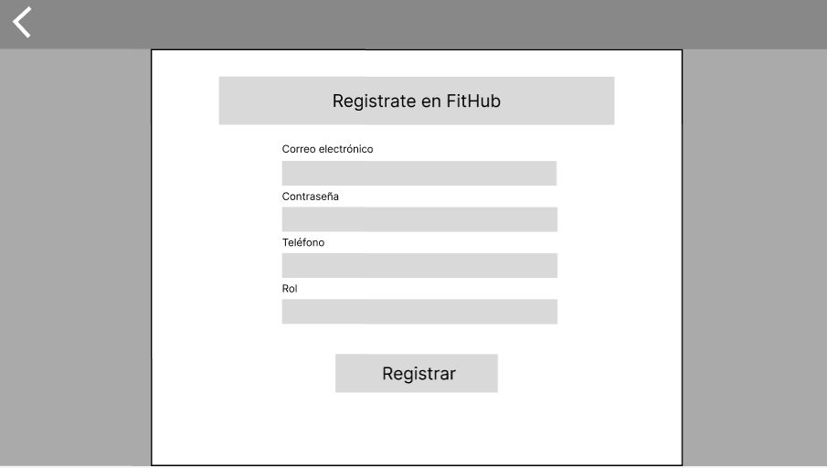

# Capítulo IV: Product UX/UI Design
## 4.1. Style Guidelines
## 4.1.1 General Style Guidelines

Brand Overview

Fithub Pro surge como una solución integral para aquellos que buscan mejorar su calidad de vida a través del ejercicio y la nutrición adecuada. Con un enfoque en la atención personalizada y basada en la ciencia, nuestra plataforma proporciona herramientas y recursos para que las personas alcancen sus metas de fitness de manera segura y efectiva.

Brand Name

El nombre del software identificado es Fithub Pro. Nuestra elección se basa en la combinación de "Fit" (en forma) y "Hub" (centro), reflejando nuestra posición como un centro centralizado para todas las necesidades relacionadas con la salud y el fitness. "Pro" se añade para denotar nuestro compromiso con la excelencia y la profesionalidad en el servicio que ofrecemos.

Typography

La tipografía desempeña un papel fundamental en la comunicación de nuestra marca. Seleccionamos cuidadosamente las fuentes para garantizar la legibilidad y la coherencia en todas nuestras plataformas.

Encabezados

|Nombre|Tamaño de Fuente|Altura de Línea|
| :- | :- | :- |
|Encabezado 1|56 px|61\.6 px|
|Encabezado 2|48 px|52\.8 px|
|Encabezado 3|40 px|44 px|
|Encabezado 4|32 px|35\.2 px|
|Encabezado 5|24 px|26\.4 px|
|Encabezado 6|20 px|22 px|

Cuerpo

|Nombre|Tamaño de Fuente|Altura de Línea|
| :- | :- | :- |
|Texto Grande (Negrita)|20 px|28 px|
|Texto Grande (Regular)|20 px|28 px|
|Texto Mediano (Negrita)|18 px|25\.2 px|
|Texto Mediano (Regular)|18 px|25\.2 px|
|Texto Normal (Negrita)|16 px|22\.4 px|
|Texto Normal (Regular)|16 px|22\.4 px|
|Texto Pequeño (Negrita)|14 px|19\.6 px|
|Texto Pequeño (Regular)|14 px|19\.6 px|

Colors

Fondo del Cuerpo: #f5f5f5
Fondo Primario (Header): #ffffff
Fondo Secundario (Contacto): #f9f9f9
Fondo del Pie de Página: #222
Color del Texto: #ffffff (general), #000 (en el pie de página), #777 (en algunos elementos)
Color del Botón Nav: #195fa4
Color de Resaltado del Botón Nav (Hover): #fff (antes era negro, pero se cambió a blanco para mantener el contraste)
Color del Botón de Envío del Formulario: #333
Color de Resaltado del Botón de Envío del Formulario (Hover): #555
Color del Texto de los Testimonios: #777

Spacing
Espaciado Interno del Contenedor: 0 a los lados
Margen Exterior del Contenedor: 0 a los lados, 5% en la parte superior e inferior
Tono de comunicación y lenguaje aplicado

Color Primario
Representa el color del uniforme básico de los profesionales de la salud, generando un ambiente de confianza entre el contratante y el personal médico.

Color Secundario
Genera un efecto hipnótico sobre la vista y la mente. Es un color sustentador de la vida y encarna la alegría y el anhelo de volver a conectar con sus seres queridos.

Blanco
Representa limpieza y claridad, muy utilizado en aplicaciones relacionadas con el cuidado de la salud.

Negro
Color serio y elegante, reflejando el tono formal y respetuoso de nuestro lenguaje, mezclado con entusiasmo y perseverancia.

## 4.1.2 Web Style Guidelines

Desarrollaremos una aplicación que se adeque a cualquier dispositivo tecnológico sin la necesidad de malograr el diseño del contenido. Por ello, se tendrá que tomar en cuenta cada tipo de dispositivo para que el contenido este estructurado de la mejor manera para cada uno.  
  
Emplearemos el patrón Z, pues de esta manera identificaran nuestra marca o logo que se encontrara en la esquina superior izquierda, donde comenzara la interacción del usuario. Luego, se desplazará hacia la derecha donde visualizará las diferentes opciones que ofreceremos. Siguientemente, el usuario se desplazará verticalmente hacia abajo para seguir interactuando con el contenido de la aplicación. Finalmente, el usuario llegará a la esquina inferior derecha donde podrá visualizar todas nuestras redes sociales y nuestros medios de contacto.  
  
 Siguientemente, el diseño de nuestra aplicación contara con colores que motiven al usuario a seguir interactuando con la plataforma. Asimismo, se contará con sombras y espacios que favorezcan la lectura de la información y limiten el contenido para no abrumar al navegante. Se emplearán algunos de los siguientes elementos:  
 Tarjetas:  
  
Elementos grandes:  
  

## 4.2 Information Architecture
## 4.2.1 Organization Systems
A continuación, explicaremos en qué grupos de información se aplicaron los distintos tipos de organización
visual para ambos segmentos objetivo, así como también en cuales se utiliza algún tipo de categorización.

Segmento 1: Personas con el objetivo de mejorar su salud y condición física
Jerárquica:
Programas de Entrenamiento: Los usuarios podrán explorar y seleccionar programas de entrenamiento diseñados para mejorar la salud y la condición física. Estos programas estarán organizados por nivel de dificultad y objetivos específicos.
Calendario de Sesiones: Los usuarios podrán visualizar y programar sesiones de entrenamiento con los entrenadores disponibles. Este calendario mostrará las sesiones disponibles y se organizará cronológicamente.
Historial de Entrenamientos: Los usuarios podrán acceder a un historial detallado de sus entrenamientos anteriores. La información estará organizada cronológicamente, mostrando los entrenamientos más recientes primero.
Secuencial:
Reserva de Sesiones: Los usuarios seguirán un proceso secuencial para reservar sesiones de entrenamiento con un entrenador específico. Este proceso incluirá la selección del entrenador, elección de la fecha y hora, confirmación de la reserva y pago si es necesario.

Segmento 2: Coaches profesionales en el ámbito del entrenamiento físico y nutrición
Jerárquica:
Lista de Clientes: Los entrenadores podrán acceder a una lista de sus clientes actuales. Esta lista estará organizada cronológicamente, mostrando los clientes con sesiones próximas primero.
Creación de Programas: Los entrenadores seguirán un proceso jerárquico para crear programas de entrenamiento y nutrición personalizados para sus clientes. Este proceso incluirá la evaluación de objetivos, diseño del programa, asignación de ejercicios y programación de sesiones.
Matricial:
Seguimiento de Progreso: Los entrenadores podrán hacer un seguimiento del progreso de sus clientes, incluyendo mediciones de rendimiento, registros de entrenamiento y notas de seguimiento. Esta información estará organizada por cliente.
Agenda de Sesiones: Los entrenadores podrán ver una agenda de todas las sesiones programadas con sus clientes. Esta agenda estará organizada cronológicamente.
Funcionalidades Compartidas:
Jerárquica:

Página de Inicio: Tanto los usuarios como los entrenadores podrán acceder a una página de inicio donde encontrarán información relevante sobre FitHub Pro, incluyendo servicios, testimonios y contacto. La información estará organizada según su importancia y categorizada por temas.
Reseñas: Tanto los usuarios como los entrenadores podrán acceder a una sección de reseñas donde encontrarán testimonios sobre la calidad del servicio. Las reseñas estarán organizadas cronológicamente.
Matricial:
Menú de Opciones: Ambos segmentos accederán a un menú principal donde podrán seleccionar las funciones que deseen realizar. Estas opciones estarán categorizadas por tipo de función.
Blog: Ambos segmentos tendrán acceso a un blog con artículos relacionados con el fitness y la salud. Los artículos estarán categorizados por temas (nutrición, entrenamiento, estilo de vida, etc.).

## 4.2.2 Labeling Systems
A continuación, se mostrará el sistema de etiquetado que otorgará una descripción breve y clara de la información mostrada en nuestra Landing Page.
Contamos con los siguientes encabezados:

- Home: Esta es la página principal de nuestro sitio web, donde puedes obtener una visión general de lo que ofrecemos en FitHub Pro.

- Plans: Sección donde se presentan los planes de nutrición disponibles. Aquí, los usuarios pueden obtener detalles sobre los diferentes planes ofrecidos, como el plan de prueba, plan mensual y plan anual.

- Contact: Sección donde los usuarios pueden encontrar información de contacto y un formulario para comunicarse con nosotros. Esto les permite realizar consultas, enviar comentarios o solicitar más información sobre nuestro servicio.

- Testimonials: Sección donde se muestran los testimonios de usuarios satisfechos con nuestro servicio. Los testimonios proporcionan credibilidad y confianza a los visitantes al mostrarles las experiencias positivas de otros usuarios.

## 4.2.3 SEO Tags and Meta Tags
A continuación, se mostrarán los SEO Tags y Meta Tags utilizados en el Landing Page con el propósito de aumentar su visibilidad en los motores de búsqueda.

## 4.2.4 Searching Systems
Es crucial contar con un sistema de búsqueda eficiente que facilite a los usuarios encontrar información específica en la aplicación web. Esta búsqueda debe ser ágil, precisa y capaz de gestionar consultas complejas. Asimismo, sería beneficioso explorar la posibilidad de añadir filtros y funciones avanzadas de búsqueda para mejorar la precisión y permitir a los usuarios refinar los resultados según sus necesidades específicas.

Para el caso de Landing Page, no se ha implementado un sistema de búsqueda, ya que la información se encuentra distribuida en secciones accesibles desde el menú principal. Esto significa que los usuarios pueden ubicar fácilmente todos los detalles necesarios para comprender nuestra propuesta y los servicios que ofrecemos. Asímismo, podrán encontrar rápidamente nuestros datos de contacto para comunicarse con nosotros.
## 4.2.5 Navigation Systems

Los sistemas de navegación eficientes son fundamentales para asegurar que los usuarios puedan acceder fácilmente a la información relevante dentro de la plataforma FitHub. Estos sistemas deben ser diseñados meticulosamente teniendo en cuenta las necesidades y la experiencia del usuario.

Primera Navegación: Acceso a las Opciones de la Aplicación
Dentro de esta navegación, los usuarios encontrarán una variedad de funcionalidades ofrecidas por FitHub, que van desde planes de nutrición personalizados hasta rutinas de ejercicios adaptadas y acceso a entrenadores expertos. Se proporcionarán detalles exhaustivos sobre cada función, incluyendo sus atributos, beneficios y métodos de operación, asegurando una comprensión completa y una fácil utilización para los usuarios.

Segunda Navegación: Búsqueda Personalizada Centrada en el Usuario
Este sistema capacita a los usuarios para realizar búsquedas personalizadas dentro de FitHub, permitiéndoles encontrar rápidamente la información específica que buscan, ya sea relacionada con nutrición, entrenamiento o seguimiento de progreso. Al facilitar el acceso eficiente a contenido relevante, esta función mejora la experiencia del usuario al mitigar la dependencia exclusiva de métodos de navegación tradicionales.

Tercera Navegación: Acceso a Instrucciones y Soporte
Dentro de este sistema, los usuarios tendrán acceso a instrucciones detalladas y recursos de soporte técnico dentro de FitHub. Esto incluye guías paso a paso sobre cómo utilizar las diferentes características de la plataforma y canales directos para comunicarse con el equipo de soporte y resolver problemas o atender consultas de manera oportuna, asegurando así una experiencia fluida para el usuario.

## 4.3 Landing Page UI Design
## 4.3.1 Landing Page Wireframe

Los wireframes son representaciones visuales simplificadas que muestran cómo se organizan los elementos en una página web o aplicación, priorizando la estructura de la información, las funciones y la experiencia del usuario. Para la landing page de FitHub, se ha optado por un diseño intuitivo que facilite al usuario en su navegación.

URL del diseño: https://www.figma.com/file/0zyX4JRoTxb9i0ODg6MRJj/Desarrollo-de-Aplicaciones-Open-Source?type=design&node-id=78%3A171&mode=design&t=HRqcjWGZ5V4KuicZ-1  

## 4.3.2 Landing Page Mock-up

Un landing page mockup es una representación visual simplificada, de mayor fidelidad que un wireframe. En este se presenta cómo se verá una landing page antes de su desarrollo final.

URL del diseño: https://www.figma.com/file/0zyX4JRoTxb9i0ODg6MRJj/Desarrollo-de-Aplicaciones-Open-Source?type=design&node-id=78%3A171&mode=design&t=HRqcjWGZ5V4KuicZ-1

## 4.4 Web Applications UX/UI Design
En esta sección, abordaremos aspectos internos donde detallaremos y describiremos la propuesta visual y de interacción para las aplicaciones que conforman la experiencia del usuario en nuestros productos digitales.

## 4.4.1 Web Applications Wireframes

URL del diseño: https://www.figma.com/file/2PFr490tJXkkgkvzRfoe3B/FitHub-Aplicacion-Web?type=design&node-id=0%3A1&mode=design&t=WG55e2n91hRk1ep0-1

### Inicio de sesión

### Registro

### Recuperacion de contraseña

### Inicio

### Perfil

### Busqueda de ejercicios

### Busqueda de dietas

### Busqueda de profesionales

### Rutina

### Dieta

### Profesional

### Contacto con el profesional

## 4.4.2 Web Applications Wireflow Diagrams

### Registro e inicio de sesión

### Búsqueda de un profesional

### Recuperar contraseña

### Visualizacion de perfil

## 4.4.3 Web Applications Mock-ups

URL del diseño: https://www.figma.com/file/2PFr490tJXkkgkvzRfoe3B/FitHub-Aplicacion-Web?type=design&node-id=0%3A1&mode=design&t=WG55e2n91hRk1ep0-1

### Inicio de sesión

### Registro

### Recuperar contraseña

### Inicio 

### Perfil

### Búsqueda Ejercicio

### Rutina

### Búsqueda Dietas

### Dieta

### Búsqueda Profesional

### Profesional

## 4.4.4 Web Applications User Flow Diagrams

URL del diseño: https://miro.com/welcomeonboard/bVJRWnIzUXhnVHhnOGxhMnZmbUh0N3VFcWtPNlRDajFTOHdFU3pLREVwNkN4UTNIOG5scWpqVnNvcktBM1ZhQnwzNDU4NzY0NTM4OTQ1NjgxNjM3fDI=?share_link_id=453725703695 

### Registro e inicio de sesión

### Búsqueda de un profesional

### Recuperar contraseña

### Visualizacion de perfil

## 4.5 Web Applications Prototyping

Link prototipo:

Link video demostrativo:

## 4.6 Domain-Driven Software Architecture
## 4.6.1 Software Architecture Context Diagram

## 4.6.2 Software Architecture Container Diagrams

## 4.6.3 Software Architecture Components Diagrams

## 4.7 Software Object-Oriented Design
## 4.7.1 Class Diagrams
###### Figura

## 4.7.2 Class Dictionary
### UserInterface
- **Attributes:**
  - userId: int
  - userName: string
  - userMail: string
  - userPassword: string
  
- **Methods:**
  - joinCommunity()
  - trackProgress()
  - addPaymentMethod()
  - seeMessages()

### User
- **Attributes:**
  - dietaryPreference: string
  - fitnessGoal: string
  - imc: string
  - achievements: List<Achievements>
  - trainers: List<Trainer>
  - messages: List<Message>
  - nutritionPlan: NutritionPlan
  - exerciseRoutine: ExerciseRoutine
  
- **Methods:**
  - getNutritionPlans()
  - scheduleTrainingSession()
  - getExerciseRoutines()

### Trainer
- **Attributes:**
  - specialty: string
  - users: List<User>
  
- **Methods:**
  - scheduleSessionTraining()
  - provideFeedback()
  - provideAdvice()
  - provideRecommendations()

### Post
- **Attributes:**
  - user: User
  - title: string
  - description: string
  - dateTime: DateTime
  
- **Methods:**
  - addPost()
  - removePost()
  - editPost()

### Community
- **Attributes:**
  - members: List<User>
  - trainers: List<Trainer>
  - achievementSection: AchievementSection
  - posts: List<Post>
  - responses: List<Response>
  
- **Methods:**
  - getAchievementSection()

### Message
- **Attributes:**
  - id: int
  - content: string
  - sender: UserInterface
  - recipient: UserInterface
  - dateTime: DateTime
  
- **Methods:**
  - sendMessage()
  - getResponse()
  - editMessage()

### AchievementSection
- **Attributes:**
  - posts: List<Post>
  - responses: List<Responses>

### Response
- **Attributes:**
  - id: int
  - message: Message
  - content: string
  - dateTime: DateTime
  
- **Methods:**
  - sendResponse()
  - editResponse()

### NutritionalTrainer
- **Methods:**
  - generateNutritionPlan()

### PhysicalTrainer
- **Methods:**
  - generateRoutine()

### NutritionPlan
- **Attributes:**
  - mealOptions: List<String>
  - caloricIntake: double
  - macroNutrientRatio: Map<String, Double>
  - restrictions: List<String>
  
- **Methods:**
  - generatePlan()
  - updatePlan()

### ExerciseRoutine
- **Attributes:**
  - exercises: List<String>
  - duration: double
  - intensity: string
  - frequency: string
  
- **Methods:**
  - generateRoutine()
  - updateRoutine()

### PaymentMethod
- **Attributes:**
  - user: UserInterface
  - type: string
  - details: string
  
- **Methods:**
  - getDetails()
  - confirmPaymentMethod()

### PaymentToTrainer
- **Attributes:**
  - id: int
  - amount: double
  
- **Methods:**
  - processPaymentToTrainer()

### PaymentMembership
- **Attributes:**
  - id: int
  - amount: double
  
- **Methods:**
  - processMembershipPayment()

## 4.8 Database Design
## 4.8.1 Database Diagram
###### Tabla de entidades

|Entidad |Atributos |
|-|-|
|usuarios |id_usuario          (int) PRIMARY KEY  nombre              (varchar(50))  apellido            (varchar(50))  direccion           (varchar(100)) pais                (varchar(50))  correo              (varchar(100)) correo_recuperacion (varchar(100)) contrasenia         (varchar(50))  telefono            (varchar(9))   foto_perfil        (image)        fecha_inscripcion   (datetime)     |
|clientes |id_cliente (int)         PRIMARY KEY meta_salud (varchar(50)) id_usuario (int) FOREIGN KEY |
|coaches |id_coach          (int)        PRIMARY KEY    anios_experiencia (varchar(4))    especialidad      (varchar(50))   certificacion     (varchar(50))    id_usuario        (int)          |
|comentarios |id_comentario (int)        PRIMARY KEY    fecha         (date)           hora          (time)           calificacion  (varchar(5))     contenido     (varchar(500))    id_sesion     (int) FOREIGN KEY |
|comunidades |id_comunidad (int)  PRIMARY KEY    tema         (varchar(50))    num_cliente  (int)           id_usuario   (int) FOREIGN KEY |
|ejercicios |id_ejercicio          (int) PRIMARY KEY          instruccion            (varchar(100))    duracion               (varchar(3))     tipo                   (varchar(50))    repeticiones           (varchar(3))     series                 (varchar(50))    id_categoria_ejercicio (int)   FOREIGN KEY  |
|membresias |id_membresia (int) PRIMARY KEY    precio       (money)          tipo         (varchar(50))     beneficio    (varchar(50)) |
|progresos |id_progreso      (int) PRIMARY KEY   mes              (varchar(50))    peso             (varchar(3))    porcentaje_grasa (varchar(3))    resistencia      (varchar(50)) |
|sesiones |id_sesion             (int) PRIMARY KEY          formato               (varchar(50))    estado_sesion         (varchar(50))    notas_coach           (varchar(50))    id_plan_entrenamiento (int) FOREIGN KEY |
|categorias_ejercicios |  id_categoria_ejercicio (int) PRIMARY KEY    nombre                 (varchar(50)) |
|clientes_progresos |id_cliente  (int) PRIMARY KEY   id_progreso (int) PRIMARY KEY|
|comunidades_usuarios |id_usuario   (int)PRIMARY KEY    id_comunidad (int)  PRIMARY KEY|
|historiales_planes_entrenamiento_clientes |id_historial          (int)  PRIMARY KEY    tipo                  (varchar(50))    id_cliente            (int )FOREIGN KEY   id_plan_entrenamiento (int)FOREIGN KEY|
|historiales_planes_nutricionales_ clientes |id_historial        (int)  PRIMARY KEY    tipo                (varchar(50))    id_plan_nutricional (int)FOREIGN KEY    id_cliente          (int)FOREIGN KEY|
|membresias_clientes |id_cliente    (int)  PRIMARY KEY   id_membresia  (int) PRIMARY KEY   fecha_inicio  (date)    fecha_final   (date)    fecha_pago    (date)     meses_miembro (int) |
|planes_ejercicios |id_plan_entrenamiento (int)PRIMARY KEY     id_ejercicio          (int) PRIMARY KEY|
|planes_entrenamiento |id_plan_entrenamiento (int)    PRIMARY KEY     duracion              (varchar(3))    accesorios            (varchar(50))    dificultad            (varchar(50))    fecha_publicacion     (datetime)    |
|planes_nutricionales |id_plan_nutricional (int)  PRIMARY KEY    meta_salud          (varchar(50))    caloria             (varchar(2))     receta              (varchar(50))    restriccion         (varchar(50)) |

###### figura

