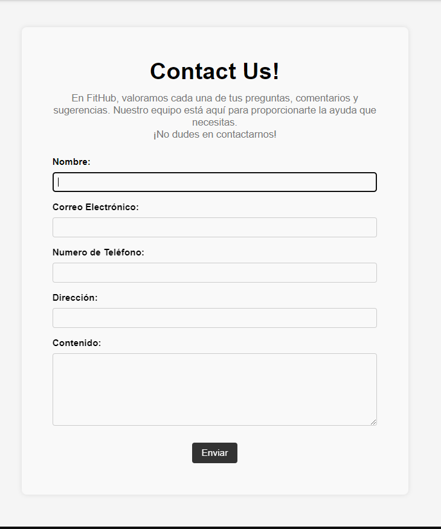

# Capítulo V: Product Implementation, Validation & Deployment
## 5.1 Software Configuration Management
## 5.1.1 Software Development Environment Configuration
**Project Management:**

- HackMD.io
Plataforma en línea que permite la colaboración en la edición de documentos utilizando Markdown, facilitando la creación y edición conjunta de contenido de forma rápida y sencilla.
Ruta de referencia: [HackMD.io](https://hackmd.io/?nav=overview)

**Product UX/UI Design:**

- Figma
Herramienta de diseño de interfaz de usuario para crear prototipos interactivos y diseños de alta calidad.
Ruta de referencia: [Figma](https://www.figma.com/login)

- Edit.org
Herramienta para la creación de user personas para el proyecto
Ruta de referencia: [Edit.org](https://edit.org)

**Software Development:**

- Visual Studio Code
Editor de código fuente para el desarrollo de la landing page del proyecto.
Ruta de descarga: [Visual Studio Code](https://code.visualstudio.com)
- WebStorm
Entorno de desarrollo integrado (IDE) para el desarrollo futuro de la aplicación web utilizando Angular.
Ruta de descarga: [WebStorm](https://www.jetbrains.com/webstorm/download/#section=windows)
- IntelliJ IDEA
Entorno de desarrollo integrado (IDE) para el desarrollo futuro del backend de la aplicación web.
Ruta de descarga: [IntelliJ IDEA](https://www.jetbrains.com/idea/download/?section=windows)

**Software Deployment:**

- GitHub Pages
Plataforma de alojamiento estático para desplegar la landing page del proyecto.
Ruta de referencia: https://pages.github.com

**Version Control:**

- GitHub Desktop
Herramienta para gestionar y controlar versiones del proyecto en GitHub.
Ruta de descarga: https://desktop.github.com

## 5.1.2 Source Code Management
**Repositorios en Github:**
| Repositorio                         | URL                                            |
|-------------------------------------|------------------------------------------------|
| Landing Page Repository             | https://github.com/Final-Project-OpenSource/LandingPageFitHub      |
| Web Services Repository             |       |
| Frontend Web Applications Repository| |

**GitFlow Workflow:**

Se implementará el flujo de trabajo GitFlow, según lo descrito en el artículo "A successful Git branching model" de Vincent Driessen.
Branches creados:
- Main Branch (rama principal)
- Develop Branch (rama de desarrollo)
- Feature Branches (ramas de características): Se creará una rama para cada nueva característica y se nombrarán siguiendo las convenciones de Conventional Commits.
- Release Branches (ramas de lanzamiento): Se crearán para preparar nuevas versiones para el lanzamiento y se nombrarán utilizando Semantic Versioning.
- Hotfix Branches (ramas de corrección rápida): Se crearán para corregir errores críticos en producción y se nombrarán siguiendo las convenciones de Conventional Commits.

**Convenciones de Nombramiento:**

- Feature Branches: Se nombrarán utilizando el prefijo "feature/" seguido de una descripción corta y descriptiva de la característica.
- Release Branches: Se nombrarán utilizando el prefijo "release/" seguido de la versión en Semantic Versioning (por ejemplo, "release/1.0.0").
Hotfix Branches: Se nombrarán utilizando el prefijo "hotfix/" seguido de una descripción corta y descriptiva del error a corregir.

**Conventional Commits:**
Se utilizarán los mensajes de commit según las convenciones de Conventional Commits para mantener un registro claro y consistente de los cambios realizados en el proyecto. Esto facilitará la generación automática de registros de cambios y la gestión del proyecto en general.
## 5.1.3 Source Code Style Guide & Conventions
En esta sección se mostrarán las pautas, convenciones, estilos y principios que se utilizarán para cada uno de los lenguajes que se emplearán en la creación de nuestra aplicación, FitHub Pro. La práctica de este conjunto de reglas es de suma importancia, ya que estas tienen el propósito de conservar la calidad estructural del software, dar una mayor legibilidad al código fuente y facilitar el mantenimiento del código.

Dado que en este proyecto se utilizarán HTML, CSS y JavaScript para la codificación de la plataforma web y Gherkins para el proceso de prueba del programa; a continuación, se nombrarán y describirán las reglas y recomendaciones generales que tomaremos en cuenta al momento de usarlos.
#### **Nomenclatura General**

A los nombres de las variables, objetos, elementos y funciones que se utilicen, se les designarán términos en inglés que estén relacionados y puedan describir a lo que están representando. No se usarán mayúsculas porque de acuerdo con W3Schools (s.f.), la mezcla de estas con las letras minúsculas luce mal y, además, el uso exclusivo de minúsculas otorga mayor legibilidad al código.

Ejemplo de nomenclatura estándar según Google (s.f.): 

#### **Sangría**

En el momento de utilizar HTML, CSS y/o JavaScript se aplicará un espaciado antes de cada línea que se encuentre dentro de un bloque. Este espacio debe ser de dos y según W3Schools (s.f.) no se debe hacer uso de la tecla “Tabulación”.

Ejemplo de nomenclatura estándar de la sangría en HTML según W3Schools (s.f.): 

Ejemplo de nomenclatura estándar de la sangría en CSS según W3Schools (s.f.): 

Ejemplo de nomenclatura estándar de la sangría en JavaScript según W3Schools (s.f.): 

Seguidamente, explicaremos las reglas específicas que se necesitan en cada lenguaje para entender el código de nuestro programa, FitHub Pro.

#### **HTML**
Llamado así por las siglas del nombre en inglés HyperText Markup Language. HTML es un lenguaje de marcado que define la estructura de una página web. Además, cuenta con funciones capaces de determinar el comportamiento de distintas partes del contenido de la página, tales como el cambiar el tamaño del texto, aplicar cursiva, entre otros. Nosotros emplearemos HTML5, y las características y pautas a seguir para hacer uso de este lenguaje son las siguientes:

#### **Declare Document Type**
El tipo de documento debe declararse en la primera línea de código. De acuerdo con Google (s.f.) HTML5 es de preferencia la mejor sintaxis para todo documento HTML, para declararla sólo es necesario copiar lo siguiente:

#### **Blank Lines**
Cada vez que, luego de un bloque, lista o tabla de gran longitud se inicie uno nuevo, se debe saltar la siguiente línea y dejarla en blanco para brindar mayor legibilidad y amenidad, así manifiesta W3Schools (s.f.).

Ejemplo: 

#### **Quote Attribute Values**

Para los valores de los atributos se utilizan comillas dobles alrededor. De acuerdo con W3Schools (s.f.) Aunque esta característica no sea obligatoria, le da más legibilidad al código y es muy frecuente entre los desarrolladores.

Ejemplo: 

#### **Multimedia Fallback**
Asegurar un acceso alterno a los objetos multimedia por si este fallara al cargar. De la misma forma, según la W3Schools (s.f.), es recomendable añadir las dimensiones del elemento porque así los navegadores guardan el espacio que utilizará antes de comenzar a cargarlo.

Ejemplo: 

#### **Never Skip the Element**

El elemento permite que las páginas aparezcan en la lista de resultados al momento de buscar en un navegador web. Asimismo, esta es la que da el nombre de la página si se la añade a favoritos.

Ejemplo: 

#### **HTML Line-Wrapping**

El hecho de que en un documento HTML no haya un límite de palabras por línea, no quiere decir que sea recomendable generar líneas muy extensas de código. Al contrario, esto dificulta la lectura del código. Para pasar a la siguiente línea es necesario utilizar al menos cuatro espacios para diferenciar de elementos hijos.

Ejemplo según Google (s.f.): 

#### **CSS**

Llamado así por las siglas del nombre en inglés Cascading Style Sheets. CSS es un lenguaje de marcado que se centra en definir y mejorar la presentación de un documento que se basa en HTML. Las pautas que a seguir al momento de usar CSS son las siguientes:

#### **Shorthand Properties**
Hay que utilizar abreviación de propiedades, declarar los campos de los elementos en la menor cantidad de líneas posibles. De acuerdo con Google (s.f.), esto aumenta la eficacia del código y lo hace más entendible. De la misma manera, debemos evitar el colocar las unidades luego del valor cero.

Ejemplo: 
 

 

#### **Declaration Stops**

Hay que colocar un punto y coma luego de cada declaración al igual que gran parte de lenguajes de programación. Según Google (s.f.). esta característica ayuda a que haya más consistencia en el código

Ejemplo: 

#### **Property Name Stops**
Debe existir un espacio entre los dos puntos que están luego del nombre de una propiedad y el valor ingresado. Siempre solo un espacio luego de los dos puntos, mas no antes.

Ejemplo estándar según Google (s.f.): 

#### **Declaration Block Separation**
El uso de un separador de un espacio es necesario luego del nombre de un elemento seleccionado y la llave que inicia un bloque. Además, esta llave tiene que estar en la misma línea.

Ejemplo estándar según Google (s.f.): 

#### **CSS Quotation Marks**
No se deben emplear las comillas dobles (“”), solo están permitidas las simples (‘’) para el uso exclusivo de selectores de atributos y valores de propiedades.

Ejemplo estándar según Google (s.f.): 

#### **JavaScript**

Es un lenguaje de programación que otorga la posibilidad de indicar exactamente las acciones que debe ejecutar el navegador, indicando el orden de las tareas y el número de veces que se realizarán. Las indicaciones para usar JavaScript en nuestro proyecto son las siguientes:

#### **Spaces around operators**
Se debe colocar un espacio alrededor de cada operador matemático que se introduzca en el código. Esto también aplica a las comas.

Ejemplo estándar según W3Schools (s.f.): 

#### **Simple Statement’s End**
Una indicación simple debe terminar en un punto y coma, esto se cumple también en muchos otros lenguajes de programación.

Ejemplo estándar según W3Schools (s.f.): 

#### **Beginning and End of a Function**

Un bloque de función debe contar con una llave al final de la primera línea, para que el cierre de esta se encuentre sola en la última. Una función termina en llave y no en punto y coma. Lo mismo aplica para condicionales o bucles.

Ejemplo estándar según W3Schhol (s.f): 

#### **Object Rules**
Para la construcción de un objeto, al igual que en una función, se comienza con una llave al final de la primera línea, pero, esta vez, la llave de cierre debe estar acompañada de un punto y coma. Para las propiedades, se colocan dos puntos y un espacio para indicar su valor, el cual debe estar entre comillas dobles si este es un

*string*.

Ejemplo estándar según W3School (s.f.): 

#### **Gherkin**
Es un Lenguaje Específico de Dominio (DSL por sus siglas en inglés) que tiene como objetivo la resolución de un problema en específico. Para ello, se generan casos para la validación de la característica en distintos escenarios. Gherkin cuenta con múltiples elementos, de los cuales, los más famosos y, además, más utilizados son *Feature, Scenario, Example, Scenario, Given, When* y *Then.* Las indicaciones para tomar en cuenta en el uso de Gherkin en nuestro código son las siguientes.

#### **Discernible Given-When-Then Blocks**
Aplicar sangría para los elementos que indiquen pasos a seguir del escenario. En el caso de *And*, aplicar dos veces. De acuerdo con Keiblinger (2021), Esto ayuda a detectar rápidamente las partes que forman un escenario.

Ejemplo:

**Scenario**: Ingreso los requisitos con claridad
**Given** que en el formulario de ingreso de oferta laboral
**When** escribo claramente los requisitos
**Then** se mostrará el mensaje
**And** mi oferta solo aparecerá a quienes cumplan con estos
**And** se habilita la opción
#### **Step with Tables**

Según Keiblinger (2021), para las partes del escenario que necesiten la introducción de valores, hay que agregar una tabla o crear un propio formulario que recree esa parte del escenario. Antes de esta representación se deben colocar dos puntos.

Ejemplo: 
 
 

#### **Reducing Noise**
Con el fin de reducir la acumulación de demasiadas líneas de código en un escenario, se deben colocar valores por defecto dentro de los pasos para los campos que no sean muy relevantes para este. Los valores “estándar” que coloquemos, deben ir entre comillas simples. De acuerdo con Keiblinger (2021), esta acción reduce considerablemente el tamaño del código.

Ejemplo: 

#### **Scenarios Separator**
Para la separación de dos escenarios, se debe insertar un salto de línea y, según Keiblinger (2021), de ser posible, hay que agregar una línea de comentario para facilitar la visualización de estos. De esta forma se halla rápidamente el inicio y fin de un escenario.

Ejemplo: 
 
 

#### **TypeScript**
El equipo usara los siguientes estilos para determinadas categorías:

**UpperCamelCase:** clase/interfaz/tipo/enum/decorador/parámetros de tipo

**lowerCamelCase**: variable / parámetro / función / método / propiedad / alias de módulo **CONSTANT\_CASE:** valores constantes globales, incluidos los valores de enumeración Nunca se utilizan identificadores privados.

Variables y Funciones

#### **Mala Nomenclatura:** 

**Buena Nomenclatura:** 

![ref6]Clases

#### **Mala Nomenclatura:** 

**Buena Nomenclatura:** 

Propiedades y métodos de la clase

#### **Mala Nomenclatura:** 

**Buena Nomenclatura:** 

Interfaces

No emplear el prefijo I para nombrar interfaces

#### **Mala Nomenclatura:** 

**Buena Nomenclatura:** 

Enums

No emplear el prefijo I para nombrar interfaces

#### **Mala Nomenclatura:** 

**Buena Nomenclatura:** 

Visibility

Restringir la visibilidad de propiedades, métodos y tipos ayudaran a mantener el código desacoplado.

#### **Mala Nomenclatura:** 

**Buena Nomenclatura:** 

Getters and Setters

Se pueden utilizar los getters y setters para los miembros de la clase. También son útiles como medio para restringir la visibilidad de los detalles de implementación internos, aplicando la Programación Orientada a Objetos;

#### **Nomenclatura:** 

Variables

Uso de const o let para declarar variables. Utilice const de forma predeterminada, a menos que sea necesario reasignar una variable.
No usar var para declarar variables.

#### **Nomenclatura:** 
 

**Module**: import \\* as foo from '...';

**Destructuring**: import {SomeThing} from '...';

**Default**: import SomeThing from '...';

**Side-effect:** import '...'; Only to import libraries for their side-effects on load (such as custom elements)

#### **Angular**
Angular es un marco de diseño de aplicaciones y una plataforma de desarrollo para crear aplicaciones de una sola página eficientes y sofisticadas. Se usará Angular siguiendo las siguientes características y pautas.

#### **Naming Components:**
Se utilizará un formato estándar para el nombre de los componentes dentro del proyecto. Los nombres de los componentes serán separados por dots (puntos) y dashes (-). Y su estructura sería “feature.type.**ts**”.

Un ejemplo estándar sería:
Para el Feature de Information: “Information.component.ts”.
Para la selección de componentes en el código se usará la estructura “dased-case” él tiene como estructura: “feature-case.component”.

#### **Naming Services:**
Se utilizará un formato estándar para el nombre de los servicios. Se agregará el sufijo de “Service” y además cada palabra iniciará con mayúscula, por ejemplo “DataService” o “PaymentService”.

#### **Unit Test File Names**
Se utilizará el mismo formato de Component para la creación de Test Files, con la diferencia que estos tendrán un “.spec” antes del “ts” al final.
Un ejemplo de la estructura sería:
Feature Information Unit Test: “Information.component.spec.ts”.

#### **Java**
Angular es un lenguaje de promagración ampliamente utilizado para programación web. Se utilizará Java junto a:

#### **Function Declaratons**
Se seguirán las siguientes características para declarar una function:
Siempre especifique la visibilidad del método (público, protegido o privado). En caso de múltiples operadores, especifique el orden usando corchetes.
Evite escribir “this.” cuando sea posible.
Un ejemplo correcto de la declaración de una función sería:
public void setGroupNames (Group group, String name)

#### **Wrapping Lines**
Cuando una expresión no alcance en una sola línea de código se seguirán las siguientes características:
Salto después de una coma.
Romper antes de un operador.
Alinee la nueva línea con el comienzo de la expresión al mismo nivel en la línea anterior.
Si las reglas anteriores conducen a un código confuso o a un código que se aprieta contra el margen derecho, solo agregar una sangría de 8 espacios en su lugar.

#### **Loop Counters**
Las variables locales en Loop siempre deberán llamarse **i, j, k, l** en todos los casos.

## 5.1.4 Software Deployment Configuration
En esta sección, describimos el proceso de despliegue de nuestra Landing Page utilizando GitHub Pages. Lo desplegamos desde la branch "main" siguiendo el flujo de trabajo GitFlow, asegurando así la estabilidad y la calidad de las implementaciones en producción.

### Deploy de la Landing Page:

### Visualización de nuestra Landing Page desplegada:

### Link de nuestra landing page:
https://final-project-opensource.github.io/LandingPageFitHub/
## 5.2 Landing Page, Services & Applications Implementation

A continuación, describiremos nuestra estrategia para ejecutar la implementación, pruebas y lanzamiento de nuestra landing page, así como también de los servicios web y la interfaz de usuario de la aplicación web en cada fase del proceso de desarrollo.

## 5.2.1 Sprint n

En esta sección se documenta y detalla el progreso del producto y el trabajo colaborativo durante el Sprint número 1. Aquí se presenta todo el avance descriptivo junto con su desarrollo, historial y avance en conjunto proporcionado por cada miembro del equipo de trabajo. Todas las especificaciones se derivan del Product Backlog del Capítulo 3 de requerimientos.

## 5.2.1.1 Sprint Planning 1

| **Sprint**                      |                                                                                                                                                                                                         |
|:--------------------------------|:--------------------------------------------------------------------------------------------------------------------------------------------------------------------------------------------------------|
| Sprint Planning Background      |                                                                                                                                                                                                         |
| Date                            | 05/04/2023                                                                                                                                                                                              |
| Time                            | 04:00 PM                                                                                                                                                                                                |
| Location                        | Servidor de Discord del Equipo                                                                                                                                                                          |
| Prepared By                     | Ricardo Jesus Maguiña Corzo                                                                                                                                                                             |
| Attendees (to planning meeting) | Ponce Loyola, Jorge Sebastian /Shimabukuro Uku, Carlos Joel / Cueto Dominguez, Juan Diego / Valenzuela Huillcaya, Aldhair Johan Juan / Maguiña Corzo, Ricardo Jesus                                     |
| Sprint n Review Summary         | En esta entrega, no hay un Sprint anterior, por lo tanto, no hay resúmen del Sprint.                                                                                                                    |
| Sprint n Retrospective Summary  | En esta entrega, no hay un Sprint anterior, por lo tanto, no hay resúmen del Sprint.                                                                                                                    |
| Sprint Goal & User Stories      |                                                                                                                                                                                                         |
| Sprint 1 Goal                   | La meta de este Sprint es la planificacion de la Landing Page, tanto su visualización, creacion del repositorio, acceso al repositorio y la visualización de los canales de comunicación de la empresa. |
| Sprint 1 Velocity               | 19 Velocity                                                                                                                                                                                             |
| Sum of Story Points             | 19 Story points                                                                                                                                                                                         |

## 5.2.1.2 Sprint Backlog 1

Esta sección revisará todo el proceso Sprint Backlog 1, donde nuestro equipo se centró principalmente en el diseño y la disposición de las páginas de inicio y lanzamiento del producto de software. Dividimos toda la página del Landing Page en cinco (5) historias de usuario, y cada miembro del equipo se encargó de una. A través de este proceso, al final del Sprint Backlog 1, creamos una página web estática para nuestra página principal.

<table>
        <tr>
            <td colspan="2">Sprint #</td>
            <td colspan="6">Sprint 1</td>
        </tr>
        <tr>
            <td colspan="2">User Story</td>
            <td colspan="6">Work-Item / Task</td>
        </tr>
        <tr>
            <td>Id</td>
            <td>Title</td>
            <td>Id</td>
            <td>Title</td>
            <td>Descripcion</td>
            <td>Estimation (Hours)</td>
            <td>Assigned To</td>
            <td>Status (To-do / In / Process / ToReview / Done)</td>
        </tr>
        <tr>
            <td>US01</td>
            <td>Introducción atractiva</td>
            <td>T01</td>
            <td>Sección con descripciones detalladas sobre la startup</td>
            <td>Como usuario, quiero ver una introducción atractiva en la página de inicio.</td>
            <td>1 hora y 30 minutos</td>
            <td>Valenzuela Huillcaya, Aldhair Johan Juan</td>
            <td>Done</td>
        </tr>
        <tr>
            <td>US02</td>
            <td>Navegación intuitiva</td>
            <td>T02</td>
            <td>Sección de navegación de facil uso para todos</td>
            <td>Como usuario, quiero poder navegar fácilmente por las diferentes secciones del sitio web.</td>
            <td>1 hora </td>
            <td>Maguiña Corzo, Ricardo Jesus </td>
            <td>Done</td>
        </tr>
        <tr>
            <td>US03</td>
            <td>Información detallada de planes</td>
            <td>T03</td>
            <td>Sección con descripciones de los planes que se ofrecen</td>
            <td>Como usuario, quiero obtener información detallada sobre los planes de suscripción disponibles.</td>
            <td>1 hora y 50 minutos</td>
            <td>Ponce Loyola, Jorge Sebastian</td>
            <td>Done</td>
        </tr>
        <tr>
            <td>US04</td>
            <td>Testimonios de usuarios</td>
            <td>T04</td>
            <td>Testimonios con casos de uso real de la aplicación </td>
            <td>Como usuario, quiero leer testimonios de otros usuarios para conocer sus experiencias con FitHub.</td>
            <td>1 hora</td>
            <td>Cueto Dominguez, Juan Diego</td>
            <td>Done</td>
        </tr>
        <tr>
            <td>US05</td>
            <td>Contactar fácilmente</td>
            <td>T05</td>
            <td>Cuestionario de contacto de parte del cliente hacia los administradores.</td>
            <td>Como usuario, quiero poder contactar con FitHub para hacer preguntas o solicitar más información.</td>
            <td>40 minutos</td>
            <td>Shimabukuro Uku, Carlos Joel </td>
            <td>Done</td>
        </tr>
          
  </table>

## 5.2.1.3 Development Evidence for Sprint Review

En esta sección se detalla y presenta el progreso en la implementación de los productos de la solución, específicamente enfocándose en el alcance del Sprint de la Landing Page. Se registrarán todos los commits implementados en el repositorio de Github, junto con información detallada sobre los cambios realizados y los resultados obtenidos.

| Repository | Branch | Commit ID | Commit Message | Commit Message Body | Commited on (Date)|
|-|-|-|-|-|-|
|LandingPageFitHub|Develop|5fd819f|feat: add testimonial link to navigation|En esta sección se añadió la barra e navegación| 02/04/24|
|LandingPageFitHub|Develop|8c41ab5|Update styles and meta tags for FitHubPro landing page| En esta añadió el archivo styles.css| 02/04/24|
|LandingPageFitHub|Develop|7c2adbe|feat: add testimonials| En esta sección se agregó la página de testimonios.| 06/04/24|
|LandingPageFitHub|Develop|8c3d45b|feat(index.html): Update index.html| En esta sección se agregó la página de bienvenido.| 10/04/24|
|LandingPageFitHub|Develop|4f5f0b9|feat(styles.css): Update styles.css| En esta sección se agregó los styles para la página de bienvenido.|10/04/24|
|LandingPageFitHub|Develop|304ff0f|feat(index.html): Update index.html| En esta sección se agregó el header y footer de la landing page.|12/04/24|
|LandingPageFitHub|Develop|ea1466d|feat (LandingPage) Add Contact|En esta sección se agrega el formulario de contacto de la landing page|12/04/24|
|LandingPageFitHub|Develop|c0565ff|feat (LandingPage) add Contact|En esta sección se editó el formulario de contacto de la landing page|12/04/24|

## 5.2.1.4 Testing Suite Evidence for Sprint Review
- Se han realizado pruebas de funcionalidad en los enlaces de navegación para asegurar que dirijan correctamente a las secciones correspondientes.
    
- Se han verificado las imágenes y los textos de la página de inicio para garantizar que se muestren correctamente.
- Se han realizado pruebas de visualización en diferentes dispositivos y resoluciones para asegurar la compatibilidad y la responsividad de la página.
  
  
- Se han probado los botones de suscripción en la sección de planes para verificar que redirijan correctamente.
- Se han realizado pruebas de validación en el formulario de contacto para garantizar que los campos obligatorios funcionen correctamente.
    
  
## 5.2.1.5 Execution Evidence for Sprint Review
- Se ha llevado a cabo una reunión de revisión de sprint donde se han presentado los avances y se ha demostrado el funcionamiento de la landing page.
- Se han realizado demostraciones de las funcionalidades implementadas, como los enlaces de navegación, las imágenes y textos, los botones de suscripción y el formulario de contacto.
- Se ha recopilado el feedback del equipo y se han identificado posibles mejoras y ajustes para futuras iteraciones.
- Se ha actualizado el tablero de proyecto con el progreso realizado durante el sprint.
- Se ha preparado la documentación necesaria para la revisión del sprint, incluyendo los artefactos de desarrollo, pruebas y ejecución.

## 5.2.1.6 Services Documentation Evidence for Sprint Review
- Se han creado documentos internos que describen la estructura y funcionalidad de la landing page, incluyendo una descripción de las secciones y el flujo de navegación.
- Se ha generado documentación técnica sobre el desarrollo de la landing page, detallando las tecnologías utilizadas, la arquitectura del sitio y las funcionalidades implementadas.
- Se han elaborado manuales de usuario para guiar a los visitantes sobre cómo navegar por la página, sus características y cómo utilizar los formularios de contacto y suscripción.
- Se ha preparado una guía de estilo para mantener la coherencia visual y de contenido en la landing page, incluyendo pautas sobre tipografía, colores, imágenes y diseño.
- Se han recopilado los recursos y activos utilizados en el desarrollo de la landing page, como imágenes, iconos, fuentes y estilos, para facilitar futuras actualizaciones y modificaciones.

## 5.2.1.7 Software Deployment Evidence for Sprint Review
- Se ha desplegado la landing page en un entorno de prueba para verificar su funcionamiento en un ambiente real.
- Se han preparado registros de despliegue que documentan el proceso de implementación.
- Se ha realizado una revisión final de la landing page desplegada para asegurar que todos los elementos y funcionalidades estén operativos.
- Se ha compartido el enlace de la landing page desplegada con el equipo para que puedan revisarla y proporcionar comentarios.
- Se ha actualizado la documentación de despliegue con los detalles del proceso y los resultados obtenidos.

## 5.2.1.8 Team Collaboration Insights during Sprint

 

Comunicación efectiva: Observar cómo el equipo se comunica entre sí puede proporcionar información sobre la claridad y la eficiencia de la comunicación dentro del equipo. Una comunicación abierta y transparente es esencial para la colaboración exitosa.
Resolución de problemas: Durante el sprint, pueden surgir problemas y desafíos inesperados. La forma en que el equipo trabaja en conjunto para resolver estos problemas puede indicar su capacidad para enfrentar desafíos y adaptarse a situaciones cambiantes.
Apoyo mutuo: Observar cómo los miembros del equipo se apoyan entre sí puede revelar la fortaleza de las relaciones dentro del equipo y su capacidad para trabajar juntos hacia un objetivo común.
Creatividad e innovación: La colaboración efectiva a menudo fomenta la creatividad y la innovación. Observar cómo el equipo genera nuevas ideas y enfoques para abordar problemas puede proporcionar información valiosa sobre su capacidad para pensar de manera creativa y adaptarse a nuevas situaciones.
Toma de decisiones: Durante el sprint, el equipo puede enfrentarse a decisiones importantes que afectan el progreso del trabajo. Observar cómo el equipo toma decisiones colectivas puede proporcionar información sobre su capacidad para llegar a consensos y tomar decisiones informadas.

# Conclusiones y Recomendaciones
Conclusiones:

FitHub Pro ofrece una plataforma bien estructurada y diseñada para satisfacer las necesidades tanto de personas que desean mejorar su salud y condición física como de coaches profesionales en el ámbito del entrenamiento físico y la nutrición.
La organización jerárquica, secuencial y matricial de la información garantiza una experiencia de usuario intuitiva y fluida, facilitando tanto la navegación para los usuarios como la gestión de clientes y sesiones para los entrenadores.
La disponibilidad de funciones compartidas, como la página de inicio, las reseñas y el menú de opciones, promueve la cohesión y la accesibilidad en toda la plataforma, brindando una experiencia unificada para todos los usuarios.
Recomendaciones:

Continuar optimizando la plataforma en función de la retroalimentación de los usuarios, con el objetivo de mejorar constantemente la experiencia del usuario y la eficiencia para los entrenadores.
Explorar la posibilidad de agregar funciones adicionales, como herramientas de seguimiento de progreso más avanzadas o recursos educativos específicos para usuarios y entrenadores.
Mantener una comunicación abierta y transparente con los usuarios y entrenadores para entender mejor sus necesidades y expectativas, y así adaptar continuamente la plataforma para satisfacerlas de manera efectiva.
