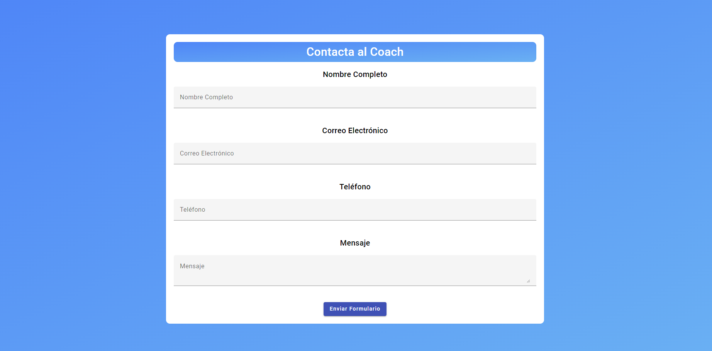
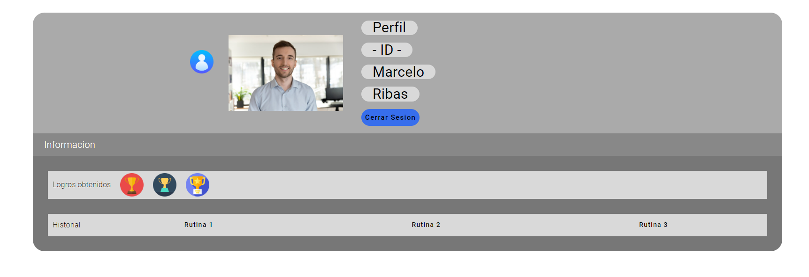

# Capítulo V: Product Implementation, Validation & Deployment
## 5.1 Software Configuration Management
## 5.1.1 Software Development Environment Configuration
**Project Management:**

- HackMD.io
Plataforma en línea que permite la colaboración en la edición de documentos utilizando Markdown, facilitando la creación y edición conjunta de contenido de forma rápida y sencilla.
Ruta de referencia: [HackMD.io](https://hackmd.io/?nav=overview)

**Product UX/UI Design:**

- Figma
Herramienta de diseño de interfaz de usuario para crear prototipos interactivos y diseños de alta calidad.
Ruta de referencia: [Figma](https://www.figma.com/login)

- Edit.org
Herramienta para la creación de user personas para el proyecto
Ruta de referencia: [Edit.org](https://edit.org)

**Software Development:**

- Visual Studio Code
Editor de código fuente para el desarrollo de la landing page del proyecto.
Ruta de descarga: [Visual Studio Code](https://code.visualstudio.com)
- WebStorm
Entorno de desarrollo integrado (IDE) para el desarrollo futuro de la aplicación web utilizando Angular.
Ruta de descarga: [WebStorm](https://www.jetbrains.com/webstorm/download/#section=windows)
- IntelliJ IDEA
Entorno de desarrollo integrado (IDE) para el desarrollo futuro del backend de la aplicación web.
Ruta de descarga: [IntelliJ IDEA](https://www.jetbrains.com/idea/download/?section=windows)

**Software Deployment:**

- GitHub Pages
Plataforma de alojamiento estático para desplegar la landing page del proyecto.
Ruta de referencia: https://pages.github.com

**Version Control:**

- GitHub Desktop
Herramienta para gestionar y controlar versiones del proyecto en GitHub.
Ruta de descarga: https://desktop.github.com

## 5.1.2 Source Code Management
**Repositorios en Github:**
| Repositorio                         | URL                                            |
|-------------------------------------|------------------------------------------------|
| Landing Page Repository             | https://github.com/Final-Project-OpenSource/LandingPageFitHub      |
| Web Services Repository             |       |
| Frontend Web Applications Repository| |

**GitFlow Workflow:**

Se implementará el flujo de trabajo GitFlow, según lo descrito en el artículo "A successful Git branching model" de Vincent Driessen.
Branches creados:
- Main Branch (rama principal)
- Develop Branch (rama de desarrollo)
- Feature Branches (ramas de características): Se creará una rama para cada nueva característica y se nombrarán siguiendo las convenciones de Conventional Commits.
- Release Branches (ramas de lanzamiento): Se crearán para preparar nuevas versiones para el lanzamiento y se nombrarán utilizando Semantic Versioning.
- Hotfix Branches (ramas de corrección rápida): Se crearán para corregir errores críticos en producción y se nombrarán siguiendo las convenciones de Conventional Commits.

**Convenciones de Nombramiento:**

- Feature Branches: Se nombrarán utilizando el prefijo "feature/" seguido de una descripción corta y descriptiva de la característica.
- Release Branches: Se nombrarán utilizando el prefijo "release/" seguido de la versión en Semantic Versioning (por ejemplo, "release/1.0.0").
Hotfix Branches: Se nombrarán utilizando el prefijo "hotfix/" seguido de una descripción corta y descriptiva del error a corregir.

**Conventional Commits:**
Se utilizarán los mensajes de commit según las convenciones de Conventional Commits para mantener un registro claro y consistente de los cambios realizados en el proyecto. Esto facilitará la generación automática de registros de cambios y la gestión del proyecto en general.
## 5.1.3 Source Code Style Guide & Conventions
En esta sección se mostrarán las pautas, convenciones, estilos y principios que se utilizarán para cada uno de los lenguajes que se emplearán en la creación de nuestra aplicación, FitHub Pro. La práctica de este conjunto de reglas es de suma importancia, ya que estas tienen el propósito de conservar la calidad estructural del software, dar una mayor legibilidad al código fuente y facilitar el mantenimiento del código.

Dado que en este proyecto se utilizarán HTML, CSS y JavaScript para la codificación de la plataforma web y Gherkins para el proceso de prueba del programa; a continuación, se nombrarán y describirán las reglas y recomendaciones generales que tomaremos en cuenta al momento de usarlos.
#### **Nomenclatura General**

A los nombres de las variables, objetos, elementos y funciones que se utilicen, se les designarán términos en inglés que estén relacionados y puedan describir a lo que están representando. No se usarán mayúsculas porque de acuerdo con W3Schools (s.f.), la mezcla de estas con las letras minúsculas luce mal y, además, el uso exclusivo de minúsculas otorga mayor legibilidad al código.

Ejemplo de nomenclatura estándar según Google (s.f.): 

#### **Sangría**

En el momento de utilizar HTML, CSS y/o JavaScript se aplicará un espaciado antes de cada línea que se encuentre dentro de un bloque. Este espacio debe ser de dos y según W3Schools (s.f.) no se debe hacer uso de la tecla “Tabulación”.

Ejemplo de nomenclatura estándar de la sangría en HTML según W3Schools (s.f.): 

Ejemplo de nomenclatura estándar de la sangría en CSS según W3Schools (s.f.): 

Ejemplo de nomenclatura estándar de la sangría en JavaScript según W3Schools (s.f.): 

Seguidamente, explicaremos las reglas específicas que se necesitan en cada lenguaje para entender el código de nuestro programa, FitHub Pro.

#### **HTML**
Llamado así por las siglas del nombre en inglés HyperText Markup Language. HTML es un lenguaje de marcado que define la estructura de una página web. Además, cuenta con funciones capaces de determinar el comportamiento de distintas partes del contenido de la página, tales como el cambiar el tamaño del texto, aplicar cursiva, entre otros. Nosotros emplearemos HTML5, y las características y pautas a seguir para hacer uso de este lenguaje son las siguientes:

#### **Declare Document Type**
El tipo de documento debe declararse en la primera línea de código. De acuerdo con Google (s.f.) HTML5 es de preferencia la mejor sintaxis para todo documento HTML, para declararla sólo es necesario copiar lo siguiente:

#### **Blank Lines**
Cada vez que, luego de un bloque, lista o tabla de gran longitud se inicie uno nuevo, se debe saltar la siguiente línea y dejarla en blanco para brindar mayor legibilidad y amenidad, así manifiesta W3Schools (s.f.).

Ejemplo: 

#### **Quote Attribute Values**

Para los valores de los atributos se utilizan comillas dobles alrededor. De acuerdo con W3Schools (s.f.) Aunque esta característica no sea obligatoria, le da más legibilidad al código y es muy frecuente entre los desarrolladores.

Ejemplo: 

#### **Multimedia Fallback**
Asegurar un acceso alterno a los objetos multimedia por si este fallara al cargar. De la misma forma, según la W3Schools (s.f.), es recomendable añadir las dimensiones del elemento porque así los navegadores guardan el espacio que utilizará antes de comenzar a cargarlo.

Ejemplo: 

#### **Never Skip the Element**

El elemento permite que las páginas aparezcan en la lista de resultados al momento de buscar en un navegador web. Asimismo, esta es la que da el nombre de la página si se la añade a favoritos.

Ejemplo: 

#### **HTML Line-Wrapping**

El hecho de que en un documento HTML no haya un límite de palabras por línea, no quiere decir que sea recomendable generar líneas muy extensas de código. Al contrario, esto dificulta la lectura del código. Para pasar a la siguiente línea es necesario utilizar al menos cuatro espacios para diferenciar de elementos hijos.

Ejemplo según Google (s.f.): 

#### **CSS**

Llamado así por las siglas del nombre en inglés Cascading Style Sheets. CSS es un lenguaje de marcado que se centra en definir y mejorar la presentación de un documento que se basa en HTML. Las pautas que a seguir al momento de usar CSS son las siguientes:

#### **Shorthand Properties**
Hay que utilizar abreviación de propiedades, declarar los campos de los elementos en la menor cantidad de líneas posibles. De acuerdo con Google (s.f.), esto aumenta la eficacia del código y lo hace más entendible. De la misma manera, debemos evitar el colocar las unidades luego del valor cero.

Ejemplo: 
 

 

#### **Declaration Stops**

Hay que colocar un punto y coma luego de cada declaración al igual que gran parte de lenguajes de programación. Según Google (s.f.). esta característica ayuda a que haya más consistencia en el código

Ejemplo: 

#### **Property Name Stops**
Debe existir un espacio entre los dos puntos que están luego del nombre de una propiedad y el valor ingresado. Siempre solo un espacio luego de los dos puntos, mas no antes.

Ejemplo estándar según Google (s.f.): 

#### **Declaration Block Separation**
El uso de un separador de un espacio es necesario luego del nombre de un elemento seleccionado y la llave que inicia un bloque. Además, esta llave tiene que estar en la misma línea.

Ejemplo estándar según Google (s.f.): 

#### **CSS Quotation Marks**
No se deben emplear las comillas dobles (“”), solo están permitidas las simples (‘’) para el uso exclusivo de selectores de atributos y valores de propiedades.

Ejemplo estándar según Google (s.f.): 

#### **JavaScript**

Es un lenguaje de programación que otorga la posibilidad de indicar exactamente las acciones que debe ejecutar el navegador, indicando el orden de las tareas y el número de veces que se realizarán. Las indicaciones para usar JavaScript en nuestro proyecto son las siguientes:

#### **Spaces around operators**
Se debe colocar un espacio alrededor de cada operador matemático que se introduzca en el código. Esto también aplica a las comas.

Ejemplo estándar según W3Schools (s.f.): 

#### **Simple Statement’s End**
Una indicación simple debe terminar en un punto y coma, esto se cumple también en muchos otros lenguajes de programación.

Ejemplo estándar según W3Schools (s.f.): 

#### **Beginning and End of a Function**

Un bloque de función debe contar con una llave al final de la primera línea, para que el cierre de esta se encuentre sola en la última. Una función termina en llave y no en punto y coma. Lo mismo aplica para condicionales o bucles.

Ejemplo estándar según W3Schhol (s.f): 

#### **Object Rules**
Para la construcción de un objeto, al igual que en una función, se comienza con una llave al final de la primera línea, pero, esta vez, la llave de cierre debe estar acompañada de un punto y coma. Para las propiedades, se colocan dos puntos y un espacio para indicar su valor, el cual debe estar entre comillas dobles si este es un

*string*.

Ejemplo estándar según W3School (s.f.): 

#### **Gherkin**
Es un Lenguaje Específico de Dominio (DSL por sus siglas en inglés) que tiene como objetivo la resolución de un problema en específico. Para ello, se generan casos para la validación de la característica en distintos escenarios. Gherkin cuenta con múltiples elementos, de los cuales, los más famosos y, además, más utilizados son *Feature, Scenario, Example, Scenario, Given, When* y *Then.* Las indicaciones para tomar en cuenta en el uso de Gherkin en nuestro código son las siguientes.

#### **Discernible Given-When-Then Blocks**
Aplicar sangría para los elementos que indiquen pasos a seguir del escenario. En el caso de *And*, aplicar dos veces. De acuerdo con Keiblinger (2021), Esto ayuda a detectar rápidamente las partes que forman un escenario.

Ejemplo:

**Scenario**: Ingreso los requisitos con claridad
**Given** que en el formulario de ingreso de oferta laboral
**When** escribo claramente los requisitos
**Then** se mostrará el mensaje
**And** mi oferta solo aparecerá a quienes cumplan con estos
**And** se habilita la opción
#### **Step with Tables**

Según Keiblinger (2021), para las partes del escenario que necesiten la introducción de valores, hay que agregar una tabla o crear un propio formulario que recree esa parte del escenario. Antes de esta representación se deben colocar dos puntos.

Ejemplo: 
 
 

#### **Reducing Noise**
Con el fin de reducir la acumulación de demasiadas líneas de código en un escenario, se deben colocar valores por defecto dentro de los pasos para los campos que no sean muy relevantes para este. Los valores “estándar” que coloquemos, deben ir entre comillas simples. De acuerdo con Keiblinger (2021), esta acción reduce considerablemente el tamaño del código.

Ejemplo: 

#### **Scenarios Separator**
Para la separación de dos escenarios, se debe insertar un salto de línea y, según Keiblinger (2021), de ser posible, hay que agregar una línea de comentario para facilitar la visualización de estos. De esta forma se halla rápidamente el inicio y fin de un escenario.

Ejemplo: 
 
 

#### **TypeScript**
El equipo usara los siguientes estilos para determinadas categorías:

**UpperCamelCase:** clase/interfaz/tipo/enum/decorador/parámetros de tipo

**lowerCamelCase**: variable / parámetro / función / método / propiedad / alias de módulo **CONSTANT\_CASE:** valores constantes globales, incluidos los valores de enumeración Nunca se utilizan identificadores privados.

Variables y Funciones

#### **Mala Nomenclatura:** 

**Buena Nomenclatura:** 

![ref6]Clases

#### **Mala Nomenclatura:** 

**Buena Nomenclatura:** 

Propiedades y métodos de la clase

#### **Mala Nomenclatura:** 

**Buena Nomenclatura:** 

Interfaces

No emplear el prefijo I para nombrar interfaces

#### **Mala Nomenclatura:** 

**Buena Nomenclatura:** 

Enums

No emplear el prefijo I para nombrar interfaces

#### **Mala Nomenclatura:** 

**Buena Nomenclatura:** 

Visibility

Restringir la visibilidad de propiedades, métodos y tipos ayudaran a mantener el código desacoplado.

#### **Mala Nomenclatura:** 

**Buena Nomenclatura:** 

Getters and Setters

Se pueden utilizar los getters y setters para los miembros de la clase. También son útiles como medio para restringir la visibilidad de los detalles de implementación internos, aplicando la Programación Orientada a Objetos;

#### **Nomenclatura:** 

Variables

Uso de const o let para declarar variables. Utilice const de forma predeterminada, a menos que sea necesario reasignar una variable.
No usar var para declarar variables.

#### **Nomenclatura:** 
 

**Module**: import \\* as foo from '...';

**Destructuring**: import {SomeThing} from '...';

**Default**: import SomeThing from '...';

**Side-effect:** import '...'; Only to import libraries for their side-effects on load (such as custom elements)

#### **Angular**
Angular es un marco de diseño de aplicaciones y una plataforma de desarrollo para crear aplicaciones de una sola página eficientes y sofisticadas. Se usará Angular siguiendo las siguientes características y pautas.

#### **Naming Components:**
Se utilizará un formato estándar para el nombre de los componentes dentro del proyecto. Los nombres de los componentes serán separados por dots (puntos) y dashes (-). Y su estructura sería “feature.type.**ts**”.

Un ejemplo estándar sería:
Para el Feature de Information: “Information.component.ts”.
Para la selección de componentes en el código se usará la estructura “dased-case” él tiene como estructura: “feature-case.component”.

#### **Naming Services:**
Se utilizará un formato estándar para el nombre de los servicios. Se agregará el sufijo de “Service” y además cada palabra iniciará con mayúscula, por ejemplo “DataService” o “PaymentService”.

#### **Unit Test File Names**
Se utilizará el mismo formato de Component para la creación de Test Files, con la diferencia que estos tendrán un “.spec” antes del “ts” al final.
Un ejemplo de la estructura sería:
Feature Information Unit Test: “Information.component.spec.ts”.

#### **Java**
Angular es un lenguaje de promagración ampliamente utilizado para programación web. Se utilizará Java junto a:

#### **Function Declaratons**
Se seguirán las siguientes características para declarar una function:
Siempre especifique la visibilidad del método (público, protegido o privado). En caso de múltiples operadores, especifique el orden usando corchetes.
Evite escribir “this.” cuando sea posible.
Un ejemplo correcto de la declaración de una función sería:
public void setGroupNames (Group group, String name)

#### **Wrapping Lines**
Cuando una expresión no alcance en una sola línea de código se seguirán las siguientes características:
Salto después de una coma.
Romper antes de un operador.
Alinee la nueva línea con el comienzo de la expresión al mismo nivel en la línea anterior.
Si las reglas anteriores conducen a un código confuso o a un código que se aprieta contra el margen derecho, solo agregar una sangría de 8 espacios en su lugar.

#### **Loop Counters**
Las variables locales en Loop siempre deberán llamarse **i, j, k, l** en todos los casos.

## 5.1.4 Software Deployment Configuration
En esta sección, describimos el proceso de despliegue de nuestra Landing Page utilizando GitHub Pages. Lo desplegamos desde la branch "main" siguiendo el flujo de trabajo GitFlow, asegurando así la estabilidad y la calidad de las implementaciones en producción.

### Deploy de la Landing Page:

### Visualización de nuestra Landing Page desplegada:

### Link de nuestra landing page:
https://final-project-opensource.github.io/LandingPageFitHub/
## 5.2 Landing Page, Services & Applications Implementation

A continuación, describiremos nuestra estrategia para ejecutar la implementación, pruebas y lanzamiento de nuestra landing page, así como también de los servicios web y la interfaz de usuario de la aplicación web en cada fase del proceso de desarrollo.

## 5.2.1 Sprint n

En esta sección se documenta y detalla el progreso del producto y el trabajo colaborativo durante el Sprint número 1. Aquí se presenta todo el avance descriptivo junto con su desarrollo, historial y avance en conjunto proporcionado por cada miembro del equipo de trabajo. Todas las especificaciones se derivan del Product Backlog del Capítulo 3 de requerimientos.

## 5.2.1.1 Sprint Planning 1

| **Sprint**                      |                                                                                                                                                                                                         |
|:--------------------------------|:--------------------------------------------------------------------------------------------------------------------------------------------------------------------------------------------------------|
| Sprint Planning Background      |                                                                                                                                                                                                         |
| Date                            | 05/04/2023                                                                                                                                                                                              |
| Time                            | 04:00 PM                                                                                                                                                                                                |
| Location                        | Servidor de Discord del Equipo                                                                                                                                                                          |
| Prepared By                     | Ricardo Jesus Maguiña Corzo                                                                                                                                                                             |
| Attendees (to planning meeting) | Ponce Loyola, Jorge Sebastian /Shimabukuro Uku, Carlos Joel / Cueto Dominguez, Juan Diego / Valenzuela Huillcaya, Aldhair Johan Juan / Maguiña Corzo, Ricardo Jesus                                     |
| Sprint n Review Summary         | En esta entrega, no hay un Sprint anterior, por lo tanto, no hay resúmen del Sprint.                                                                                                                    |
| Sprint n Retrospective Summary  | En esta entrega, no hay un Sprint anterior, por lo tanto, no hay resúmen del Sprint.                                                                                                                    |
| Sprint Goal & User Stories      |                                                                                                                                                                                                         |
| Sprint 1 Goal                   | La meta de este Sprint es la planificacion de la Landing Page, tanto su visualización, creacion del repositorio, acceso al repositorio y la visualización de los canales de comunicación de la empresa. |
| Sprint 1 Velocity               | 19 Velocity                                                                                                                                                                                             |
| Sum of Story Points             | 19 Story points                                                                                                                                                                                         |

## 5.2.1.2 Sprint Backlog 1

Esta sección revisará todo el proceso Sprint Backlog 1, donde nuestro equipo se centró principalmente en el diseño y la disposición de las páginas de inicio y lanzamiento del producto de software. Dividimos toda la página del Landing Page en cinco (5) historias de usuario, y cada miembro del equipo se encargó de una. A través de este proceso, al final del Sprint Backlog 1, creamos una página web estática para nuestra página principal.

<table>
        <tr>
            <td colspan="2">Sprint #</td>
            <td colspan="6">Sprint 1</td>
        </tr>
        <tr>
            <td colspan="2">User Story</td>
            <td colspan="6">Work-Item / Task</td>
        </tr>
        <tr>
            <td>Id</td>
            <td>Title</td>
            <td>Id</td>
            <td>Title</td>
            <td>Descripcion</td>
            <td>Estimation (Hours)</td>
            <td>Assigned To</td>
            <td>Status (To-do / In / Process / ToReview / Done)</td>
        </tr>
        <tr>
            <td>US01</td>
            <td>Introducción atractiva</td>
            <td>T01</td>
            <td>Sección con descripciones detalladas sobre la startup</td>
            <td>Como usuario, quiero ver una introducción atractiva en la página de inicio.</td>
            <td>1 hora y 30 minutos</td>
            <td>Valenzuela Huillcaya, Aldhair Johan Juan</td>
            <td>Done</td>
        </tr>
        <tr>
            <td>US02</td>
            <td>Navegación intuitiva</td>
            <td>T02</td>
            <td>Sección de navegación de facil uso para todos</td>
            <td>Como usuario, quiero poder navegar fácilmente por las diferentes secciones del sitio web.</td>
            <td>1 hora </td>
            <td>Maguiña Corzo, Ricardo Jesus </td>
            <td>Done</td>
        </tr>
        <tr>
            <td>US03</td>
            <td>Información detallada de planes</td>
            <td>T03</td>
            <td>Sección con descripciones de los planes que se ofrecen</td>
            <td>Como usuario, quiero obtener información detallada sobre los planes de suscripción disponibles.</td>
            <td>1 hora y 50 minutos</td>
            <td>Ponce Loyola, Jorge Sebastian</td>
            <td>Done</td>
        </tr>
        <tr>
            <td>US04</td>
            <td>Testimonios de usuarios</td>
            <td>T04</td>
            <td>Testimonios con casos de uso real de la aplicación </td>
            <td>Como usuario, quiero leer testimonios de otros usuarios para conocer sus experiencias con FitHub.</td>
            <td>1 hora</td>
            <td>Cueto Dominguez, Juan Diego</td>
            <td>Done</td>
        </tr>
        <tr>
            <td>US05</td>
            <td>Contactar fácilmente</td>
            <td>T05</td>
            <td>Cuestionario de contacto de parte del cliente hacia los administradores.</td>
            <td>Como usuario, quiero poder contactar con FitHub para hacer preguntas o solicitar más información.</td>
            <td>40 minutos</td>
            <td>Shimabukuro Uku, Carlos Joel </td>
            <td>Done</td>
        </tr>
          
  </table>

## 5.2.1.3 Development Evidence for Sprint Review

En esta sección se detalla y presenta el progreso en la implementación de los productos de la solución, específicamente enfocándose en el alcance del Sprint de la Landing Page. Se registrarán todos los commits implementados en el repositorio de Github, junto con información detallada sobre los cambios realizados y los resultados obtenidos.

| Repository | Branch | Commit ID | Commit Message | Commit Message Body | Commited on (Date)|
|-|-|-|-|-|-|
|LandingPageFitHub|Develop|5fd819f|feat: add testimonial link to navigation|En esta sección se añadió la barra e navegación| 02/04/24|
|LandingPageFitHub|Develop|8c41ab5|Update styles and meta tags for FitHubPro landing page| En esta añadió el archivo styles.css| 02/04/24|
|LandingPageFitHub|Develop|7c2adbe|feat: add testimonials| En esta sección se agregó la página de testimonios.| 06/04/24|
|LandingPageFitHub|Develop|8c3d45b|feat(index.html): Update index.html| En esta sección se agregó la página de bienvenido.| 10/04/24|
|LandingPageFitHub|Develop|4f5f0b9|feat(styles.css): Update styles.css| En esta sección se agregó los styles para la página de bienvenido.|10/04/24|
|LandingPageFitHub|Develop|304ff0f|feat(index.html): Update index.html| En esta sección se agregó el header y footer de la landing page.|12/04/24|
|LandingPageFitHub|Develop|ea1466d|feat (LandingPage) Add Contact|En esta sección se agrega el formulario de contacto de la landing page|12/04/24|
|LandingPageFitHub|Develop|c0565ff|feat (LandingPage) add Contact|En esta sección se editó el formulario de contacto de la landing page|12/04/24|

## 5.2.1.4 Testing Suite Evidence for Sprint Review
- Se han realizado pruebas de funcionalidad en los enlaces de navegación para asegurar que dirijan correctamente a las secciones correspondientes.
    
- Se han verificado las imágenes y los textos de la página de inicio para garantizar que se muestren correctamente.
- Se han realizado pruebas de visualización en diferentes dispositivos y resoluciones para asegurar la compatibilidad y la responsividad de la página.
  
  
- Se han probado los botones de suscripción en la sección de planes para verificar que redirijan correctamente.
- Se han realizado pruebas de validación en el formulario de contacto para garantizar que los campos obligatorios funcionen correctamente.
    
  
## 5.2.1.5 Execution Evidence for Sprint Review
- Se ha llevado a cabo una reunión de revisión de sprint donde se han presentado los avances y se ha demostrado el funcionamiento de la landing page.
- Se han realizado demostraciones de las funcionalidades implementadas, como los enlaces de navegación, las imágenes y textos, los botones de suscripción y el formulario de contacto.
- Se ha recopilado el feedback del equipo y se han identificado posibles mejoras y ajustes para futuras iteraciones.
- Se ha actualizado el tablero de proyecto con el progreso realizado durante el sprint.
- Se ha preparado la documentación necesaria para la revisión del sprint, incluyendo los artefactos de desarrollo, pruebas y ejecución.

## 5.2.1.6 Services Documentation Evidence for Sprint Review
- Se han creado documentos internos que describen la estructura y funcionalidad de la landing page, incluyendo una descripción de las secciones y el flujo de navegación.
- Se ha generado documentación técnica sobre el desarrollo de la landing page, detallando las tecnologías utilizadas, la arquitectura del sitio y las funcionalidades implementadas.
- Se han elaborado manuales de usuario para guiar a los visitantes sobre cómo navegar por la página, sus características y cómo utilizar los formularios de contacto y suscripción.
- Se ha preparado una guía de estilo para mantener la coherencia visual y de contenido en la landing page, incluyendo pautas sobre tipografía, colores, imágenes y diseño.
- Se han recopilado los recursos y activos utilizados en el desarrollo de la landing page, como imágenes, iconos, fuentes y estilos, para facilitar futuras actualizaciones y modificaciones.

## 5.2.1.7 Software Deployment Evidence for Sprint Review
- Se ha desplegado la landing page en un entorno de prueba para verificar su funcionamiento en un ambiente real.
- Se han preparado registros de despliegue que documentan el proceso de implementación.
- Se ha realizado una revisión final de la landing page desplegada para asegurar que todos los elementos y funcionalidades estén operativos.
- Se ha compartido el enlace de la landing page desplegada con el equipo para que puedan revisarla y proporcionar comentarios.
- Se ha actualizado la documentación de despliegue con los detalles del proceso y los resultados obtenidos.

## 5.2.1.8 Team Collaboration Insights during Sprint

 

Comunicación efectiva: Observar cómo el equipo se comunica entre sí puede proporcionar información sobre la claridad y la eficiencia de la comunicación dentro del equipo. Una comunicación abierta y transparente es esencial para la colaboración exitosa.
Resolución de problemas: Durante el sprint, pueden surgir problemas y desafíos inesperados. La forma en que el equipo trabaja en conjunto para resolver estos problemas puede indicar su capacidad para enfrentar desafíos y adaptarse a situaciones cambiantes.
Apoyo mutuo: Observar cómo los miembros del equipo se apoyan entre sí puede revelar la fortaleza de las relaciones dentro del equipo y su capacidad para trabajar juntos hacia un objetivo común.
Creatividad e innovación: La colaboración efectiva a menudo fomenta la creatividad y la innovación. Observar cómo el equipo genera nuevas ideas y enfoques para abordar problemas puede proporcionar información valiosa sobre su capacidad para pensar de manera creativa y adaptarse a nuevas situaciones.
Toma de decisiones: Durante el sprint, el equipo puede enfrentarse a decisiones importantes que afectan el progreso del trabajo. Observar cómo el equipo toma decisiones colectivas puede proporcionar información sobre su capacidad para llegar a consensos y tomar decisiones informadas.
## 5.2.2. Sprint 2
## 5.2.2.1.Sprint Planning 2.
| **Sprint**                      |                                                                                                                                                                                                         |
|:--------------------------------|:--------------------------------------------------------------------------------------------------------------------------------------------------------------------------------------------------------|
| Sprint Planning Background      |                                                                                                                                                                                                         |
| Date                            | 15/04/2024                                                                                                                                                                                              |
| Time                            | 01:00 PM                                                                                                                                                                                                |
| Location                        | Servidor de Discord del Equipo                                                                                                                                                                          |
| Prepared By                     | Jorge Sebastian Ponce Loyola                                                                                                                                                                             |
| Attendees (to planning meeting) | Ponce Loyola, Jorge Sebastian /Shimabukuro Uku, Carlos Joel / Cueto Dominguez, Juan Diego / Valenzuela Huillcaya, Aldhair Johan Juan / Maguiña Corzo, Ricardo Jesus                                     |
| Sprint n Review Summary         | En la entrega anterior realizamos exitosamente la landing page de FitHub Pr                                                                                                                   |
| Sprint n Retrospective Summary  | Realizamos un buen trabajo, pero con algunas mejoras por realizar                                                                                                                |
| Sprint Goal & User Stories      |                                                                                                                                                                                                         |
| Sprint 2 Goal                   | La meta de este Sprint es realizar el avance de la Aplicación Web de FitHub, tanto su visualización, creacion del repositorio, acceso al repositorio y funcionalidad |
| Sprint 2 Velocity               | 43 Velocity                                                                                                                                                                                             |
| Sum of Story Points             | 43 Story points                                                                                                                                                                                         |
## 5.2.2.2.Sprint Backlog 2.

<table>
        <tr>
            <td colspan="2">Sprint #</td>
            <td colspan="6">Sprint 2</td>
        </tr>
        <tr>
            <td colspan="2">User Story</td>
            <td colspan="6">Work-Item / Task</td>
        </tr>
        <tr>
            <td>Id</td>
            <td>Title</td>
            <td>Id</td>
            <td>Title</td>
            <td>Descripcion</td>
            <td>Estimation (Hours)</td>
            <td>Assigned To</td>
            <td>Status (To-do / In / Process / ToReview / Done)</td>
        </tr>
        <tr>
            <td>US06</td>
            <td>Seguimiento de progreso al usuario en FitHub por medio de su coach encargado</td>
            <td>T01</td>
            <td>Página donde se muestra el seguimineto del progreso.</td>
            <td>Como usuario de FitHub, quiero poder establecer metas de entrenamiento específicas para recibir recomendaciones personalizadas por parte del coach especializado.</td>
            <td>1 hora y 30 minutos</td>
            <td>Juan Diego Cueto</td>
            <td>Done</td>
        </tr>
        <tr>
            <td>US07</td>
            <td>Asesoramiento nutricional dentro de FitHub con especialistas en nutrición</td>
            <td>T02</td>
            <td>Página donde se visualiza el asesoramiento nutricional del especialista.</td>
            <td>Como usuario de FitHub, quiero poder acceder a un asesoramiento nutricional personalizado a mis metas para ajustar mi dieta diaria.</td>
            <td>1 hora </td>
            <td>Carlos Shimabukuro</td>
            <td>Done</td>
        </tr>
        <tr>
            <td>US08</td>
            <td>Gamificación para aumentar la motivación a realizar actividades físicas en FitHub.</td>
            <td>T03</td>
            <td>Página donde se pueden inscribir a retos dentro de la aplicación.</td>
            <td>Como usuario de FitHub, quiero participar en esafíos de gmaificacion en donde se pueda tener objetivos de entrenamientos.</td>
            <td>1 hora y 50 minutos</td>
            <td>Ricardo Maguiña</td>
            <td>Done</td>
        </tr>
        <tr>
            <td>US09</td>
            <td>Personalización de entrenamiento por el coach.</td>
            <td>T04</td>
            <td>Página donde se puede personalizar el entrenamiento que te brinda tu coach.</td>
            <td>Como usuario de FitHub, quiero recibir planes de entrenamiento personalizadas basadas en mis preferencias para optimizar mi rendimiento y obtener resultados en mi salud.</td>
            <td>1 hora</td>
            <td>Aldhair Valenzuela</td>
            <td>Done</td>
        </tr>
        <tr>
            <td>US10</td>
            <td>Planificacion de sesiones de entrenamiento con un coach.</td>
            <td>T05</td>
            <td>Página donde se planifica las sesiones de entrenamiento.</td>
            <td>Como usuario de FitHub, quiero poder planificar y programar mis sesiones de entrenamiento para mantener una rutina organizada.</td>
            <td>1 hora</td>
            <td>Aldhair Valenzuela</td>
            <td>Done</td>
        </tr>
        <tr>
            <td>US12</td>
            <td>Refactorizar Código para Mejorar Mantenibilidad.</td>
            <td>T06</td>
            <td>Refactorización del código.</td>
            <td>Como desarrollador, Quiero refactorizar el código existente, Para mejorar su estructura y facilitar el mantenimiento futuro.</td>
            <td>1 hora 10 minutos</td>
            <td>Juan Diego Cueto</td>
            <td>Done</td>
        </tr>
        <tr>
            <td>US14</td>
            <td>Desarrollar Funcionalidad de Notificaciones.</td>
            <td>T07</td>
            <td>Página donde se visualizan las notificaciones de la aplicación.</td>
            <td>Como desarrollador, Quiero desarrollar la funcionalidad de notificaciones, Para mantener a los usuarios informados sobre eventos importantes.</td>
            <td>1 hora </td>
            <td>Ricardo Maguiña</td>
            <td>Done</td>
        </tr>
        <tr>
            <td>US17</td>
            <td>Filtrado de contenido por nivel de habilidad.</td>
            <td>T08</td>
            <td>Página donde se puede visualizar el contenido por nivel de habilidad.</td>
            <td>Como usuario, quiero ver una introducción atractiva en la página de inicio.Para encontrar opciones adecuadas para mí.</td>
            <td>50 minutos</td>
            <td>Carlos Shimabukuro</td>
            <td>Done</td>
        </tr>
        <tr>
            <td>US21</td>
            <td>Registro de nuevo usuario.</td>
            <td>T09</td>
            <td>Página en donde se puede registrar un nuevo usuario a la aplicación.</td>
            <td>Como un nuevo usuario interesado en estar en forma utilizando FitHub, quiero poder registrarme en el aplicativo web, para acceder a las funcionalidades que se ofrece.</td>
            <td>30 minutos</td>
            <td>Jorge Ponce</td>
            <td>Done</td>
        </tr>
        <tr>
            <td>US22</td>
            <td>Inicio de sesión con cuenta registrada.</td>
            <td>T10</td>
            <td>Página en donde se puede ingresar a la aplicación con una cuenta previamente registrada.</td>
            <td>Como usuario previamente registrado en FitHub, quiero poder iniciar sesión de manera segura en mi cuenta personal, para acceder al contenido del aplicativo web.</td>
            <td>30 minutos</td>
            <td>Jorge Ponce</td>
            <td>Done</td>
        </tr>
        <tr>
            <td>US23</td>
            <td>Recuperación de contraseña.</td>
            <td>T11</td>
            <td>Página en donde se puede recuperar la contraseña de una cuenta previamente registrada.</td>
            <td>Como usuario registrado en FitHub, quiero tener la capacidad de restablecer mi contraseña en caso de olvidarla, para acceder a mi cuenta en cualquier momento.</td>
            <td>20 minutos</td>
            <td>Jorge ponce</td>
            <td>Done</td>
        </tr>
        <tr>
            <td>US24</td>
            <td>Búsqueda de coach profesionales.</td>
            <td>T12</td>
            <td>Página en donde se puede visualizar a los coaches dentro de la aplicación.</td>
            <td>Como un usuario interesado contáctame con un coach profesional, quiero poder realizar búsquedas de los coaches disponibles en la aplicación web, para comparar y encontrar al que mejor se adapte a mis necesidades y preferencias.</td>
            <td>50 minutos</td>
            <td>Aldhair Valenzuela</td>
            <td>Done</td>
        </tr>
        <tr>
            <td>US25</td>
            <td>Visualización del perfil del coach profesional.</td>
            <td>T13</td>
            <td>Página en donde se puede visualizar los datos de los coaches dentro de la aplicación.</td>
            <td>Como usuario interesado entrenar con la ayuda de un coach profesional, quiero poder ver perfiles detallados de los coaches disponibles en la aplicación web, para obtener información completa sobre ellos antes selección a quien contactar.</td>
            <td>50 minutos</td>
            <td>Aldhair Valenzuela</td>
            <td>Done</td>
        </tr>
  </table>
  
## 5.2.2.3.Development Evidence for Sprint Review.

| Repository | Branch | Commit ID | Commit Message | Commit Message Body | Commited on (Date)|
|-|-|-|-|-|-|
|FitHub-Web-Application|Develop|ed946a7|chore(setup): initial project structure|En esta sección se añadió la estructura inicial para el proyecto|22/04/24|
|FitHub-Web-Application|Develop|746f6af|fix(structure): corrections in project structure| En esta se realizaron algunas correciones en la estructura del proyecto| 22/04/24|
|FitHub-Web-Application|Develop|827564c|feat: add landing-page, login, register and recovery-passwords| En esta sección se agregó el login, register, recovery-password y la landing page, todo conectado entre sí.| 25/04/24|
|FitHub-Web-Application|Develop|ef1ec77|feat: add coach-information feat: add coach-contact| En esta sección se agregó la información del coach y el formulario para contactar al coach.|26/04/24|
|FitHub-Web-Application|Develop|1d3a542|feat: add profile-components|En esta sección se la page de profile.|30/04/24|

## 5.2.2.4.Testing Suite Evidence for Sprint Review.
- Se han realizado pruebas de funcionalidad en las páginas de seguimiento de progreso, asesoramiento nutricional, gamificación, personalización de entrenamiento y planificación de sesiones para verificar su funcionamiento.
- Se han probado las páginas de registro, inicio de sesión y recuperación de contraseña para garantizar que los usuarios puedan acceder y gestionar sus cuentas de manera segura.
- Se han realizado pruebas de búsqueda y visualización de perfiles de coach para verificar que los usuarios puedan encontrar y obtener información detallada sobre los coaches disponibles.
- Se han llevado a cabo pruebas de rendimiento y optimización para garantizar que la aplicación web sea rápida y eficiente en su funcionamiento.
- Se han realizado pruebas de compatibilidad y responsividad en diferentes dispositivos y navegadores para asegurar una experiencia de usuario consistente y de alta calidad.
  
- **Evidencia de pruebas de componentes de la aplicación web.**

  
- **Evidencia de pruebas de enrutamientos de secciones de la aplicación web.**

    
## 5.2.2.5.Execution Evidence for Sprint Review.
- Se ha llevado a cabo una reunión de revisión de sprint donde se han presentado los avances y se ha demostrado el funcionamiento de la aplicación web.
- Se han realizado demostraciones de las funcionalidades implementadas, como el seguimiento de progreso, el asesoramiento nutricional, la gamificación y la planificación de sesiones.
- Se ha recopilado el feedback del equipo y se han identificado posibles mejoras y ajustes para futuras iteraciones.
- Se ha actualizado el tablero de proyecto con el progreso realizado durante el sprint.
- Se ha preparado la documentación necesaria para la revisión del sprint, incluyendo los artefactos de desarrollo, pruebas y ejecución.
- Se ha compartido el enlace de la aplicación web desplegada con el equipo para que puedan revisarla y proporcionar comentarios.
- Se ha actualizado la documentación de despliegue con los detalles del proceso y los resultados obtenidos.
    
- **Evidencia de ejecución de funcionalidad de la seccion de inicio de sesión.**
  
  
  
    
- **Evidencia de ejecución de funcionalidad del contacto de coach.**
  
  
    
- **Evidencia de ejecución de funcionalidad de la página de perfil del coach y miembro.**
  
  
## 5.2.2.6.Services Documentation Evidence for Sprint Review.
- Se ha creado la estructura inicial del proyecto en la rama Develop del repositorio FitHub-Web-Application, con el commit ID ed946a7, el cual incluye la configuración inicial del proyecto.
- Se realizaron correcciones en la estructura del proyecto en la rama Develop del repositorio FitHub-Web-Application, con el commit ID 746f6af, abordando aspectos identificados para mejorar la organización del código.
- Se agregaron funcionalidades clave, incluyendo la página de inicio, el inicio de sesión, el registro de usuarios y la recuperación de contraseñas en la rama Develop del repositorio FitHub-Web-Application, con el commit ID 827564c, interconectándolos para una experiencia de usuario fluida.
- Se ha añadido la funcionalidad para visualizar información del coach y un formulario de contacto para comunicarse con el coach en la rama Develop del repositorio FitHub-Web-Application, con el commit ID ef1ec77, ampliando así las capacidades de la aplicación web.
## 5.2.2.7.Software Deployment Evidence for Sprint Review.
- El aplicativo web ha sido desplegado en un entorno de prueba para evaluar su funcionamiento en un entorno real y controlado.
- Se han elaborado registros de despliegue que detallan el proceso de implementación.
- Se ha llevado a cabo una revisión final del aplicativo web desplegado para garantizar que todas sus características y funcionalidades estén activas y cumplan con los requisitos establecidos durante el desarrollo.
- Se ha compartido el enlace del aplicativo web desplegado con el equipo para que puedan examinarlo, ofrecer comentarios y realizar las modificaciones necesarias.
- La documentación de despliegue ha sido actualizada con los detalles del proceso y los resultados obtenidos.
## 5.2.2.8.Team Collaboration Insights during Sprint.
Durante el sprint, se observó una alta interacción entre los miembros del equipo, evidenciada por la frecuente comunicación en el servidor de Discord del equipo. 
Se notó un compromiso compartido hacia los objetivos del sprint, con los miembros trabajando de manera colaborativa para superar los desafíos y alcanzar los hitos establecidos. 
La retroalimentación constructiva fue una parte integral del proceso, con los miembros proporcionando comentarios útiles sobre el progreso del trabajo y buscando constantemente mejorar la calidad del producto. 
La distribución equitativa de tareas y responsabilidades promovió un ambiente de trabajo inclusivo y fomentó la participación activa de todos los miembros del equipo. 
La transparencia en la comunicación y la disposición para compartir conocimientos contribuyeron a un flujo de trabajo eficiente y a una mayor cohesión dentro del equipo. 

## 5.2.3 Sprint 3
## 5.2.3.1 Sprint Planning 3
| **Sprint**                      |                                                                                                                                                                                                         |
|:--------------------------------|:--------------------------------------------------------------------------------------------------------------------------------------------------------------------------------------------------------|
| Sprint Planning Background      |                                                                                                                                                                                                         |
| Date                            | 03/06/2024                                                                                                                                                                                              |
| Time                            | 06:00 PM                                                                                                                                                                                                |
| Location                        | Grupo de WhatsApp del Equipo                                                                                                                                                                        |
| Prepared By                     | Jorge Sebastian Ponce Loyola                                                                                                                                                                             |
| Attendees (to planning meeting) | Ponce Loyola, Jorge Sebastian /Shimabukuro Uku, Carlos Joel / Cueto Dominguez, Juan Diego / Valenzuela Huillcaya, Aldhair Johan Juan / Maguiña Corzo, Ricardo Jesus                                     |
| Sprint 2 Review Summary         | En la entrega anterior le faltaban detalles y cosas para adicionar a nuestro proyecto, para este sprint 3, ya tenemos realizado todo el frontEnd                                                                                                              |
| Sprint 2 Retrospective Summary  | Realizamos un buen trabajo, pero con algunas mejoras por realizar                                                                                                                |
| Sprint Goal & User Stories      |                                                                                                                                                                                                         |
| Sprint 3 Goal                   | La meta de este Sprint es realizar un buen avance del Web Services de FitHubPro, un 60% de avance de todas nuestras tablas(endpoints), las más importantes |
| Sprint 3 Velocity               | 26 Velocity                                                                                                                                                                                             |
| Sum of Story Points             | 26 Story points                                                                                                                                                                                         |
## 5.2.3.2 Sprint Backlog 3
<table>
        <tr>
            <td colspan="2">Sprint #</td>
            <td colspan="6">Sprint 3</td>
        </tr>
        <tr>
            <td colspan="2">User Story</td>
            <td colspan="6">Work-Item / Task</td>
        </tr>
        <tr>
            <td>Id</td>
            <td>Title</td>
            <td>Id</td>
            <td>Title</td>
            <td>Descripcion</td>
            <td>Estimation (Hours)</td>
            <td>Assigned To</td>
            <td>Status (To-do / In / Process / ToReview / Done)</td>
        </tr>
        <tr>
            <td>TS01</td>
            <td>Consumir el endpoint User (Login/Register)</td>
            <td>TS01</td>
            <td>Consumir el endpoint User (Login/Register)</td>
            <td>Como desarrollador, quiero consumir eficazmente el endpoint 'User (Login/Register)' para implementar un proceso de autenticación y registro de usuarios fluido y seguro en la aplicación.</td>
            <td>8 horas</td>
            <td>Cueto Dominguez, Juan Diego</td>
            <td>Done</td>
        </tr>
        <tr>
            <td>TS04</td>
            <td>Seguimiento del progreso de clientes</td>
            <td>TS04</td>
            <td>Seguimiento del progreso de clientes</td>
            <td>Como desarrollador, quiero implementar la funcionalidad para registrar y visualizar el progreso de los clientes en sus entrenamientos y planes nutricionales.</td>
            <td>5 horas </td>
            <td>Maguiña Corzo, Ricardo Jesus </td>
            <td>Done</td>
        </tr>
        <tr>
            <td>TS03</td>
            <td>Gestionar rutinas de entrenamiento</td>
            <td>TS03</td>
            <td>Gestionar rutinas de entrenamiento</td>
            <td>Como desarrollador, quiero implementar la creación y gestión de rutinas de entrenamiento para los clientes.</td>
            <td>5 horas</td>
            <td>Valenzuela Huillcaya, Aldhair Johan Juan</td>
            <td>Done</td>
        </tr>
        <tr>
            <td>TS05</td>
            <td>Gestión de planes nutricionales</td>
            <td>TS05</td>
            <td>Gestión de planes nutricionales</td>
            <td>Como desarrollador, quiero implementar la creación y gestión de planes nutricionales personalizados para los clientes.</td>
            <td>5 horas</td>
            <td>Ponce Loyola, Jorge Sebastian</td>
            <td>Done</td>
        </tr>
          
  </table>

## 5.2.3.3 Development Evidence for Sprint Review
| Repository | Branch | Commit ID | Commit Message | Commit Message Body | Commited on (Date)|
|-|-|-|-|-|-|
|FitHub-Web-Service|Develop|d3df5e2|first commit|En este commit se añadió la estructura del proyecto| 03/06/24|
|FitHub-Web-Service|Develop|6865c25|chore: refactor packages|En este commit se refactorizaró la estructura del proyecto| 03/06/24|
|FitHub-Web-Service|Develop|c88c7da|feat: add NutritionPlan Endpoint|En este commit se creó el endpoint NutritionPlan| 04/06/24|
|FitHub-Web-Service|Develop|134520d|feat(iam): added user entity class, getters and setter.|En este commit se añadió el user entity class| 07/06/24|
|FitHub-Web-Service|Develop|5b063b9|feat(iam): added user aggregate and commands.|En este commit se añadió el agreggate y commands de iam| 07/06/24|
|FitHub-Web-Service|Develop|c5d0c9d|feat(iam): implemented controllers, commands services and repository.|En este commit se implementó el controller, command service y repository de iam| 07/06/24|
|FitHub-Web-Service|Develop|970d28e|docs(iam): implemented code documentation.|En este commit se implementó documentación de codigo(java docs) para iam| 07/06/24|
|FitHub-Web-Service|Develop|0856f25|refactor: removed unused annotations.|En este commit se eliminaron annotations que no se usaban| 07/06/24|
|FitHub-Web-Service|Develop|57d0b5d|feat add rutines model|En este commit se añadió rutines | 07/06/24|
|FitHub-Web-Service|Develop|74b9646|feat Upate Rutines controller.|En este commit se actualizó el controller de rutines | 08/06/24|

## 5.2.3.4 Testing Suite Evidence for Sprint Review
- Se han realizado pruebas de consumo del endpoint 'User (Login/Register)' para verificar la autenticación y el registro de usuarios en la aplicación.
- Se han probado las funcionalidades de seguimiento de progreso de clientes, gestión de rutinas de entrenamiento y planes nutricionales para garantizar su correcto funcionamiento.
- Se han realizado pruebas de gestión de perfiles de usuarios para verificar que los usuarios puedan actualizar su información personal y datos de contacto.
- Se han llevado a cabo pruebas de rendimiento y optimización para garantizar que los endpoints sean eficientes y respondan rápidamente.
- Se han realizado pruebas de compatibilidad y responsividad en diferentes dispositivos y navegadores para asegurar una experiencia de usuario consistente y de alta calidad.
- Se han verificado los registros de despliegue para asegurar que los endpoints se hayan implementado correctamente y estén disponibles para su uso.
     **Organización de los bounded context.**  
  
  
   **Evidencia de implementacion del bounded context IAM.** 
 
   **Evidencia de implementacion del bounded context Counseling.**  

## 5.2.3.5 Execution Evidence for Sprint Review
- Se ha llevado a cabo una reunión de revisión de sprint donde se han presentado los avances y se ha demostrado el funcionamiento de los endpoints implementados.
- Se han realizado demostraciones de las funcionalidades de consumo de endpoints, registro, login, gestión de rutinas de entrenamiento y planes nutricionales.
- Se ha recopilado el feedback del equipo y se han identificado posibles mejoras y ajustes para futuras iteraciones.
- Se ha actualizado el tablero de proyecto con el progreso realizado durante el sprint.
- Se ha preparado la documentación necesaria para la revisión del sprint, incluyendo los artefactos de desarrollo, pruebas y ejecución.

## 5.2.3.6 Services Documentation Evidence for Sprint Review
En las tablas, se detallan las acciones disponibles para cada Endpoint, especificando el verbo HTTP correspondiente (GET, POST, PUT, DELETE, PATCH), la estructura de la llamada, y la descripción de los parámetros posibles. Se incluye también un ejemplo de cada llamada y una explicación del response obtenido. Además de la tabla, se muestran capturas de pantalla que ilustran cómo interactuar con la documentación creada, utilizando datos de ejemplo para demostrar el uso de cada Endpoint.
*Tabla del modelo de escritura para el EndPoinrt del DBJson con respecto a la base de los usuarios.*
| Método | Descripción | Ejemplo de llamada | Parámetros | Respuesta |
|--------|-------------|---------------------|------------|-----------|
|GET |Obtener todos los usuarios mediante el username|Get/{username}|Username|Usuario completo que coincide con el username brindado|
|POST|Agregar usuario| POST/ | Datos del usuario a crear en formato JSON en el cuerpo de la solicitud, incluyendo nombre, correo, contraseña, etc. |Mensaje de éxito o error en formato JSON, junto con el ID asignado al nuevo usuario creado.|
|GET |Lista de usuarios | GET/ | Ninguno | Brinda una lista de usuarios con todos los parámetros completos|

*Tabla del modelo de escritura para el EndPoinrt del DBJson con respecto a la base de los planes de nutrición.*
| Método | Descripción | Ejemplo de llamada | Parámetros | Respuesta |
|--------|-------------|---------------------|------------|-----------|
|POST | Agregar plan de nutrición | POST/ | Datos del plan de nutrición | Mensaje de éxito o error en formato JSON, junto con el ID asignado al plan de nutrición       |
|GET | Obtener los planes de nutrición | GET/ | Ninguno | Lista con todos los planes de nutrición |
|GET | Obtener el plan de nutrición meidante el ID | GET/{id} | ID del plan de nutrición |Datos del plan de nutrición con el ID brindado | 
|GET | Obtener el plan de nutrición meidante el title | GET/{title} | Title del plan de nutrición | Datos del plan de nutrición con el title brindado |
|GET | Obtener el plan de nutrición meidante el goalHealth | GET/{goalHealth} | goalHealth del plan de nutrición | Datos del plan de nutrición con el goalHealth brindado |
|GET | Obtener el plan de nutrición meidante el restriction | GET/{restriction} | restriction del plan de nutrición |Datos del plan de nutrición con el restriction brindado | 
|GET | Obtener el plan de nutrición meidante las calories | GET/{calories} | calories del plan de nutrición |Datos del plan de nutrición con las calories brindado | 
|GET | Obtener el plan de nutrición meidante los ingredients | GET/{ingredients} | ingredients del plan de nutrición | Datos del plan de nutrición con los ingredients brindado |
|GET | Obtener el plan de nutrición meidante el description | GET/{description} | description del plan de nutrición | Datos del plan de nutrición con el description brindado |
|GET | Obtener el plan de nutrición meidante el TitleAndGoalHealth | GET/{TitleAndGoalHealth} | TitleAndGoalHealth del plan de nutrición | Datos del plan de nutrición con el TitleAndGoalHealth brindado |
|GET | Obtener el plan de nutrición meidante el parameters | GET/{parameters} | parameters del plan de nutrición | Datos del plan de nutrición con el parameters brindado |

*Tabla del modelo de escritura para el EndPoinrt del DBJson con respecto a la base de las rutinas.*
| Método | Descripción | Ejemplo de llamada | Parámetros | Respuesta |
|--------|-------------|---------------------|------------|-----------|
|POST | Agregar rutina | POST/ | Datos de la rutina | Mensaje de éxito o error en formato JSON, junto con el ID asignado a la rutina |
|GET | Obtener las rutinas | GET/ | Ninguno | Lista con todas las rutinas|
|GET | Obtener las rutinas meidante el ID | GET/{id} | ID de las rutinas |Datos de las rutinas con el ID brindado | 
|GET | Obtener las rutinas meidante el Exercise | GET/{Exercise} | ID del Exercise |Datos de las rutinas con el Exercise brindado | 
|GET | Obtener las rutinas meidante el Instruction | GET/{Instruction} | ID de las Instruction |Datos de las rutinas con el Instruction brindado | 
## 5.2.3.7 Software Deployment Evidence for Sprint Review

Durante el Sprint 3, se realizaron las siguientes actividades de implementación de software: 
El servicio backend ha sido desplegado en un entorno de prueba, permitiendo la evaluación de su funcionalidad en un entorno controlado. 
Se han creado registros detallados del despliegue que documentan cada paso del proceso de implementación. 
Se ha realizado una revisión exhaustiva del backend desplegado, asegurando que todas las funcionalidades operen correctamente y cumplan con los requisitos establecidos. 
Se ha compartido el enlace del servicio backend desplegado con el equipo, permitiendo la revisión, retroalimentación y realización de ajustes necesarios. 
La documentación de despliegue ha sido actualizada, incluyendo los detalles del proceso de implementación y los resultados obtenidos. 

## 5.2.3.8 Team Collaboration Insights during Sprint

Durante el sprint, se observó una notable interacción entre los miembros del equipo, destacada por la constante comunicación en el servidor de Discord del equipo. 
Hubo un compromiso colectivo con los objetivos del sprint, con los miembros colaborando para superar los desafíos y alcanzar los hitos establecidos. 
La retroalimentación constructiva fue fundamental en el proceso, con los miembros proporcionando comentarios valiosos sobre el progreso del trabajo y buscando continuamente mejorar la calidad del producto. 
La distribución equitativa de tareas y responsabilidades fomentó un ambiente de trabajo inclusivo y promovió la participación activa de todos los miembros del equipo. 
La transparencia en la comunicación y la disposición para compartir conocimientos contribuyeron a un flujo de trabajo eficiente y a una mayor cohesión dentro del equipo. 

## 5.2.4 Sprint 4
## 5.2.4.1 Sprint Planning 4
| **Sprint**                      |                                                                                                                                                                                                         |
|:--------------------------------|:--------------------------------------------------------------------------------------------------------------------------------------------------------------------------------------------------------|
| Sprint Planning Background      |                                                                                                                                                                                                         |
| Date                            | 16/06/2024                                                                                                                                                                                              |
| Time                            | 12:00 PM                                                                                                                                                                                                |
| Location                        | Grupo de WhatsApp del Equipo                                                                                                                                                                        |
| Prepared By                     | Jorge Sebastian Ponce Loyola                                                                                                                                                                             |
| Attendees (to planning meeting) | Ponce Loyola, Jorge Sebastian /Shimabukuro Uku, Carlos Joel / Cueto Dominguez, Juan Diego / Valenzuela Huillcaya, Aldhair Johan Juan / Maguiña Corzo, Ricardo Jesus                                     |
| Sprint 3 Review Summary         | En la entrega anterior avanzamos el 50% de nuestro backend                                                                                                      |
| Sprint 3 Retrospective Summary  | Realizamos un buen trabajo, pero aún nos faltan cosas por hacer                                                                                                              |
| Sprint Goal & User Stories      |                                                                                                                                                                                                         |
| Sprint 4 Goal                   | La meta de este Sprint es terminar el backend y consumir la API en el front|
| Sprint 3 Velocity               | 21 Velocity                                                                                                                                                                                             |
| Sum of Story Points             | 21 Story points                                                                                                                                                                                         |
## 5.2.4.2 Sprint Backlog 4
<table>
        <tr>
            <td colspan="2">Sprint #</td>
            <td colspan="6">Sprint 3</td>
        </tr>
        <tr>
            <td colspan="2">User Story</td>
            <td colspan="6">Work-Item / Task</td>
        </tr>
        <tr>
            <td>Id</td>
            <td>Title</td>
            <td>Id</td>
            <td>Title</td>
            <td>Descripcion</td>
            <td>Estimation (Hours)</td>
            <td>Assigned To</td>
            <td>Status (To-do / In / Process / ToReview / Done)</td>
        </tr>
        <tr>
            <td>TS01</td>
            <td>Consumir el endpoint User (Login/Register)</td>
            <td>TS01</td>
            <td>Consumir el endpoint User (Login/Register)</td>
            <td>Como desarrollador, quiero consumir eficazmente el endpoint 'User (Login/Register)' para implementar un proceso de autenticación y registro de usuarios fluido y seguro en la aplicación.</td>
            <td>8 horas</td>
            <td>Cueto Dominguez, Juan Diego</td>
            <td>In Progress</td>
        </tr>
        <tr>
            <td>TS02</td>
            <td>Gestión de perfiles de usuarios</td>
            <td>TS02</td>
            <td>Seguimiento del progreso de clientes</td>
            <td>Como desarrollador, quiero implementar la gestión de perfiles de usuarios para que puedan actualizar su información personal, foto de perfil y datos de contacto.</td>
            <td>5 horas</td>
            <td>Maguiña Corzo, Ricardo Jesus</td>
            <td>Done</td>
        </tr>
        <tr>
            <td>TS06</td>
            <td>Gestión de Solicitudes</td>
            <td>TS06</td>
            <td>Gestión de Solicitudes</td>
            <td>Como desarrollador, quiero implementar la gestión de solicitudes para facilitar la interacción entre clientes y servicios.</td>
            <td>5 horas</td>
            <td>Ponce Loyola, Jorge Sebastian</td>
            <td>Done</td>
        </tr>
        <tr>
            <td>TS07</td>
            <td>Administración de coaches</td>
            <td>TS07</td>
            <td>Administración de coaches</td>
            <td>Como desarrollador, quiero implementar la funcionalidad para gestionar la información de los coaches, incluyendo su experiencia, especialidades y clientes.</td>
            <td>5 horas</td>
            <td>Cueto Dominguez, Juan Diego</td>
            <td>Done</td>
        </tr>
        <tr>
            <td>TS08</td>
            <td>Administración de Clientes</td>
            <td>TS08</td>
            <td>Administración de Clientes</td>
            <td>Como desarrollador, quiero implementar la administración de la información de los clientes para permitir actualizaciones y gestión eficaz de sus perfiles.</td>
            <td>5 horas</td>
            <td>Maguiña Corzo, Ricardo Jesus</td>
            <td>Done</td>
        </tr>
          
  </table>

## 5.2.4.3 Development Evidence for Sprint Review
| Repository | Branch | Commit ID | Commit Message | Commit Message Body | Commited on (Date)|
|-|-|-|-|-|-|
| FitHub-Web-Service | Develop | 6a7f577 | feat: add Progress Endpoint | En este commit se creo el endpoint correspondiente a progress | 09/06/24 |
| FitHub-Web-Service | Develop | eaee159 | feat(iam): iam aggregates, entities, endpoints, and controllers implemented and shared package updated | Implementación de IAM: agregados IAM, entidades, endpoints y controladores, con actualización del paquete compartido | 23/06/24 |
| FitHub-Web-Service | Develop | 83dbaae | fix(iam): merging problems solved and jwt properties fixed | En este commit se han solucionado problemas de fusión y se han corregido las propiedades JWT | 23/06/24 |
| FitHub-Web-Service | Develop | 1d3686d | refactor(iam): user aggregate, commands and services constraints updated | En este commit se han actualizado los agregados de usuario, los comandos y las restricciones de servicios | 23/06/24 |
| FitHub-Web-Service | Develop | 1e4b4fb | refactor(iam): phonenumber object type updated | En este commit se ha actualizado el tipo de objeto para el número de teléfono | 23/06/24 |
| FitHub-Web-Application | Develop | 840cdd2 | feat: update router links for coach-dashboard | En este commit se han actualizado los enlaces del enrutador para coach-dashboard | 20/06/24 |
| FitHub-Web-Application | Develop | c62fa71 | feat: add validation to login, register and recovery | En este commit se ha añadido validación a inicio de sesión, registro y recuperación | 20/06/24 |
| FitHub-Web-Application | Develop | 8eaade0 | feat: update component-chat & services | En este commit Se actualizó el componente chat y los services | 21/06/24 |
| FitHub-Web-Service | Develop | 9530444 | feat: update coach-list view | En este commit se ha actualizado la vista de lista de coaches | 22/06/24 |

## 5.2.4.4 Testing Suite Evidence for Sprint Review
 - Se han realizado pruebas de consumo del endpoint para verificar el seguimiento de progreso de clientes en la aplicación.
 - Se han probado las funcionalidades de IAM para asegurar la gestión adecuada de identidades, accesos y permisos en la aplicación.
 - Se han realizado pruebas de autenticación y autorización utilizando JWT para garantizar su correcto funcionamiento tras resolver problemas de fusión.
 - Se han probado las funcionalidades de gestión de perfiles de usuarios para asegurar la actualización correcta de información personal y datos de contacto.
 - Se han llevado a cabo pruebas de gestión de perfiles de usuarios para verificar que los usuarios puedan actualizar su información personal y datos de contacto.
 - Se han realizado pruebas de navegación y usabilidad para asegurar que los enlaces del enrutador para coach-dashboard funcionen correctamente.
 - Se han probado las funcionalidades de autenticación y registro con validación para asegurar la seguridad y precisión de los datos ingresados.
 - Se han realizado pruebas de rendimiento y optimización del componente chat y servicios asociados para asegurar su eficiencia y funcionamiento correcto.
 - Se han probado las funcionalidades de visualización y gestión de coaches para asegurar una experiencia de usuario consistente y de alta calidad.

## 5.2.4.5 Execution Evidence for Sprint Review

## 5.2.4.6 Services Documentation Evidence for Sprint Review

## 5.2.4.7 Software Deployment Evidence for Sprint Review
Durante el Sprint 4, se llevaron a cabo las siguientes actividades de implementación de software:

Se desplegó el servicio backend en un entorno de prueba, lo que permitió evaluar su funcionalidad en un ambiente controlado.

Se crearon registros detallados del despliegue, documentando cada paso del proceso de implementación.

Se realizó una revisión exhaustiva del backend desplegado para asegurar que todas las funcionalidades operaran correctamente y cumplieran con los requisitos establecidos.

Se compartió el enlace del servicio backend desplegado con el equipo, facilitando la revisión, retroalimentación y ajustes necesarios.

Se actualizó la documentación de despliegue, incluyendo los detalles del proceso de implementación y los resultados obtenidos.

Además, se desplegó nuevamente el frontend, incorporando nuevas características y mejoras a la aplicación.

## 5.2.4.8 Team Collaboration Insights during Sprint

## 5.3 Validation Interviews
## 5.3.1 Diseño de Entrevistas
El equipo es responsable de definir, para cada segmento objetivo identificado, los elementos que deben incluirse en la sesión de validación. Esto incluye tanto el análisis de la Landing Page como de las aplicaciones asociadas. Además, se describe el diseño de los flujos de usuario de las aplicaciones, los cuales serán esenciales en el proceso de validación. Estos flujos de usuario, que representan la secuencia de acciones que los usuarios realizarán dentro de las aplicaciones, son fundamentales para asegurar una experiencia de usuario óptima. De esta forma, se garantiza que cada paso que los usuarios den a través de las aplicaciones sea coherente, intuitivo y cumpla con los objetivos de diseño establecidos previamente.

**Preguntas generales:**
1. ¿Qué tan satisfecho estás con la experiencia general en nuestra plataforma?
2. ¿Encontraste algún problema o dificultad mientras usabas nuestra aplicación? Si es así, ¿cuál?
3. ¿Le recomendarías a otros usuarios el uso de nuestra plataforma?

**Segmento 1: Personas que buscan mejorar su salud y forma física:**
1. ¿Cuál fue tu impresión inicial al usar FitHub? ¿Te pareció intuitivo y fácil de manejar?
2. ¿Qué tan sencillo te resultó encontrar la información y las funciones que necesitabas?
3. ¿Qué tan simple te resultó encontrar a tu coach ideal?
4. ¿Hubo alguna parte de la aplicación que te pareciera confusa o difícil de entender?
5. ¿Te parece útil la función de recibir recomendaciones de un coach?
6. ¿Qué características o herramientas de la aplicación te resultaron más valiosas? ¿Por qué?
7. ¿Qué mejoras o nuevas funcionalidades te gustaría ver en FitHub para que sea más útil para ti?

**Segmento 2: Coaches profesionales en entrenamiento físico y nutrición:**
1. ¿Cómo te imaginas tu experiencia al publicar tus servicios de coach en nuestra plataforma? ¿Te parecería un proceso sencillo?
2. ¿Las herramientas disponibles para gestionar notificaciones y progresos (como editar información, publicar avances, etc.) son adecuadas y fáciles de usar?
3. ¿Consideras que la plataforma proporciona suficiente información para que un usuario conozca todo lo que puedes ofrecer como coach?
4. ¿Estás satisfecho con el alcance y visibilidad de tus publicaciones en nuestra plataforma?
5. Comparado con otros sitios similares, ¿cómo evaluarías nuestra plataforma en términos de efectividad y usabilidad para ofrecer tus servicios?
6. ¿Qué herramientas o características de la plataforma encuentras más útiles para tus necesidades como coach online?
7. ¿Hay alguna característica adicional que te gustaría tener para mejorar la efectividad de tus publicaciones?
8. ¿Qué cambios o mejoras recomendarías para hacer nuestra plataforma más efectiva para quienes brindan servicios?

   
## 5.3.2 Registro de Entrevistas
**Entrevista N°1** 
<!--  -->  
 **Datos principales:**
 - Nombre completo del entrevistado: Andrew Jesus Contreras Cahuapas
 - Edad: 25
 - Distrito: San Isidro
 - Link: https://upcedupe-my.sharepoint.com/:v:/g/personal/u202121858_upc_edu_pe/EQ5_mO_QJFFJihAEQ0yd4-UBrIE-brSihyjSa78Z6iS6Hw?e=EnGFTH
 - Inicio de la entrevista: 10:00 AM
 - Duración: 3:04
 - Entrevistador: Ricardo Jesus Maguiña Corzo
 - Resumen: La entrevista con Andrew Contreras proporcionó una perspectiva muy positiva sobre la experiencia de usuario en FitHub Pro. Andrew destacó la facilidad de navegación, la claridad de la interfaz y la utilidad de las recomendaciones personalizadas y la sección de seguimiento de progreso. No experimentó ningún problema durante el uso de la aplicación y no sugirió mejoras específicas, indicando una alta satisfacción con las funcionalidades actuales. Este feedback positivo refuerza la calidad de nuestro diseño y nos motiva a continuar ofreciendo una experiencia de usuario excelente. 

**Entrevista N°2** 
    
 **Datos principales:**
 - Nombre completo del entrevistado: Max Sabino Arostegui
 - Edad: 23
 - Distrito: Chorrillos
 - Link: https://upcedupe-my.sharepoint.com/:v:/g/personal/u20201f572_upc_edu_pe/EfLVhTYMKS1Ls6BgoXZKeOsBVPo504AU9OFOPAPXVZugiA?e=9T4hOh&nav=eyJyZWZlcnJhbEluZm8iOnsicmVmZXJyYWxBcHAiOiJTdHJlYW1XZWJBcHAiLCJyZWZlcnJhbFZpZXciOiJTaGFyZURpYWxvZy1MaW5rIiwicmVmZXJyYWxBcHBQbGF0Zm9ybSI6IldlYiIsInJlZmVycmFsTW9kZSI6InZpZXcifX0%3D 
 - Inicio de la entrevista: 0:05
 - Duración: 6:50
 - Entrevistador: Aldhair Valenzuela Huillcaya
 - Resumen: La entrevista con Max Sabino reveló una experiencia de usuario positiva en Fithub, destacando la claridad de la landing page, la facilidad de navegación y la utilidad de las funciones esenciales como los planes nutricionales y los entrenamientos. Aunque sugirió aumentar el tamaño de algunos textos y una visualización más gráfica del progreso de entrenamiento, valoró la posibilidad de contactar con profesionales y recibir recomendaciones del coach. En general, mostró alta satisfacción con las funcionalidades actuales, reafirmando la eficacia del diseño y usabilidad de Fithub, con algunas áreas para mejorar. 

**Entrevista N°3** 
    
 **Datos principales:** 
 - Nombre completo de la entrevistado: Jesus Stefano Torres Reeyes
 - Edad: 22
 - Distrito: Ica
 - Link: https://upcedupe-my.sharepoint.com/:v:/g/personal/u202120471_upc_edu_pe/EYUMSPxO3tVMgT-KQJMFzFEBWR0D7sslnBsy6Iq6pak3Nw?nav=eyJyZWZlcnJhbEluZm8iOnsicmVmZXJyYWxBcHAiOiJPbmVEcml2ZUZvckJ1c2luZXNzIiwicmVmZXJyYWxBcHBQbGF0Zm9ybSI6IldlYiIsInJlZmVycmFsTW9kZSI6InZpZXciLCJyZWZlcnJhbFZpZXciOiJNeUZpbGVzTGlua0NvcHkifX0&e=tmCAqu
 - Inicio de la entrevista: 0:02
 - Duración: 6:26
 - Entrevistador: Jorge Sebastian Ponce Loyola
 - Resumen: En la entrevista con Jesus Torres, calificó la aplicación con un 8/10. Encontró la experiencia de publicación de servicios sencilla y clara, y las herramientas para gestionar notificaciones y progresos adecuadas y fáciles de usar. Considera que la plataforma proporciona información básica, pero sugiere más detalles. Está satisfecho con el alcance y visibilidad de las publicaciones, aunque faltan métricas específicas. La plataforma es efectiva y fácil de usar comparada con otras similares. Destacó como útiles las herramientas para administrar rutinas, progreso y ver clientes. Sugirió agregar mensajes personalizados, carga de videos de entrenamiento, un blog, integración con redes sociales y un mejor sistema de notificaciones. 

**Entrevista N°4** 
    
 **Datos principales:** 
 - Nombre completo de la entrevistado: Valeria Makino Rojas
 - Edad: 25
 - Distrito:  Lima
 - Link: https://upcedupe-my.sharepoint.com/personal/u201912407_upc_edu_pe/_layouts/15/stream.aspx?id=%2Fpersonal%2Fu201912407%5Fupc%5Fedu%5Fpe%2FDocuments%2FOS%20%2D%20Entrevista%20Validacion%201%2Emp4&nav=eyJyZWZlcnJhbEluZm8iOnsicmVmZXJyYWxBcHAiOiJTdHJlYW1XZWJBcHAiLCJyZWZlcnJhbFZpZXciOiJTaGFyZURpYWxvZy1MaW5rIiwicmVmZXJyYWxBcHBQbGF0Zm9ybSI6IldlYiIsInJlZmVycmFsTW9kZSI6InZpZXcifX0&ga=1&referrer=StreamWebApp%2EWeb&referrerScenario=AddressBarCopied%2Eview%2E677dae3e%2D203d%2D4510%2D827e%2Df3f6e91826da
 - Inicio de la entrevista: 0:00
 - Duración: 7:20
 - Entrevistador: Carlos Joel Shimabukuro Uku
 - Resumen: Durante la entrevista con Valeria, mencionó que la aplicación fue intuitiva y fácil de navegar. Encontró las funcionalidades actuales muy útiles, lo que contribuyó a una experiencia positiva y satisfactoria. Valeria también destacó que la capacidad de publicación es especialmente beneficiosa para los servicios que ofrece. Además, recomendó añadir un sistema de feedback detallado para que los clientes puedan dejar comentarios específicos sobre los servicios recibidos. 

## 5.3.3 Evaluación según heurísticas
Esta sección detalla el proceso de evaluación de sesiones de validación, basado en principios que abordan aspectos como usabilidad e información. El objetivo es garantizar una evaluación exhaustiva de la experiencia del usuario, identificando fortalezas y áreas de mejora en el diseño de aplicaciones para mejorar su calidad y eficacia.

Site o app a evaluar: FitHub 

Tareas a evaluar: El alcance de esta evaluación incluye la revisión de la usabilidad de las siguientes tareas:

1. Funciones de gestión de cuentas de usuario
2. Adecuada secuencia y coherencia al desplazarse entre las distintas páginas de la aplicación web
3. Visualización de lista de ejercicios
4. Acceso a perfil de usuario

Escala de severidad: Los errores serán puntuados tomando en cuenta la siguiente escala de severidad.

| Nivel | Descripción                                                                                                                                      |
|-------|--------------------------------------------------------------------------------------------------------------------------------------------------|
| 1     | Problema superficial: Este tipo de problema es fácilmente manejable por el usuario o se presenta con escasa frecuencia. No es prioritario resolverlo a menos que exista disponibilidad de tiempo. |
| 2     | Problema menor: Estos problemas pueden ocurrir con más frecuencia o pueden ser un poco más desafiantes para el usuario. Se les debe asignar una baja prioridad para su resolución en el próximo lanzamiento.   |
| 3     | Problema mayor: Ocurre con frecuencia o los usuarios tienen dificultades para resolverlo. Es crucial abordarlos y se les debe asignar una prioridad alta para su corrección.                             |
| 4     | Problema muy grave: Se trata de un error de gran impacto que impide al usuario continuar utilizando la herramienta. Es esencial que se corrija antes del lanzamiento.                                           |

Tabla resumen:

| Número | Problema                                                                                                      | Escala de severidad | Heurística/Principio violada(o)               |
|--------|---------------------------------------------------------------------------------------------------------------|---------------------|----------------------------------------------|
| 1      | Incluye un botón “Registrar” pero no existe contenido al que dirigirse                                        | 3                   | Information Architecture: Is it usable?     |
| 2      | Incluye un botón “Recuperar Contraseña” pero no existe contenido al que dirigirse                            | 3                   | Information Architecture: Is it usable?     |
| 3      | En la sección de perfil de usuario, los datos no han sido reemplazados por contenido real.                    | 2                   | Usability: Consistencia y estándares         |
| 4      | Ausencia de restricciones y comprobaciones en ciertas entradas de datos.                                      | 3                   | Usability: Prevención de errores            |
| 5      | Se muestran algunos títulos y etiquetas en inglés, mientras que el resto del contenido está en español.      | 1                   | Usability: Compatibilidad entre el sistema y el mundo real |

PROBLEMA #1: Incluye un botón “Registrar” pero no existe contenido al que dirigirse 
Severidad: 3 
Heurística violada: Information Architecture: Is it usable? 
Problema: 
En la sección de registro se encuentra un botón etiquetado como "Registrar", sin embargo, al hacer clic en él, no hay contenido al que dirigirse. Esta situación puede generar confusión en los usuarios, ya que esperan que el botón los lleve a una página o formulario para completar el proceso de registro, pero en su lugar no encuentran ninguna acción asociada. 
 
Recomendación: 
 - Desactivar temporalmente el botón "Registrar" si la funcionalidad aún no está disponible.
 - Cambiar la etiqueta del botón para reflejar su estado actual, por ejemplo, "Próximamente" o "Registro Próximamente".
 - Incluir un mensaje o indicación junto al botón para informar a los usuarios sobre la situación actual y evitar confusiones.
 - Priorizar la implementación de la funcionalidad de registro lo antes posible para ofrecer una experiencia de usuario completa y satisfactoria.

PROBLEMA #2: Incluye un botón “Recuperar Contraseña” pero no existe contenido al que dirigirse 
Severidad: 3 
Heurística violada: Information Architecture: Is it usable? 
Problema: 
Se identifica la presencia de un botón "Recuperar Contraseña" en la sección correspondiente, pero al seleccionarlo, no se redirige a ningún contenido. Esto puede resultar confuso para los usuarios, ya que esperan acceder a un formulario o proceso para iniciar la recuperación de su contraseña. 
 
Recomendaciones: 
 - Junto al botón "Recuperar Contraseña", incluir un mensaje que indique claramente que la función aún no está disponible pero que próximamente lo estará. Esto ayudará a mitigar la confusión de los usuarios.
 - En lugar de simplemente no llevar a ningún contenido, hacer que el botón "Recuperar Contraseña" esté inactivo o atenuado para indicar visualmente que no está disponible en este momento.
 - Ofrecer a los usuarios una alternativa para recibir asistencia si necesita recuperar su contraseña de inmediato. Esto podría incluir un enlace directo al soporte técnico o una página de contacto donde puedan obtener ayuda personalizada.
 - Mantener a los usuarios informados sobre el progreso de la implementación de la función de recuperación de contraseña a través de actualizaciones periódicas en la plataforma o a través de correos electrónicos si están suscritos.

PROBLEMA #3: En la sección de perfil de usuario, los datos no han sido reemplazados por contenido real. 
Severidad: 2 
Heurística violada: Usability: Consistencia y estándares 
Problema: 
Esta situación incumple con la expectativa del usuario de ver información precisa y actualizada en su perfil, lo que puede generar confusión y desconfianza. La falta de actualización de los datos puede afectar la credibilidad de la plataforma y perjudicar la experiencia del usuario. 
 
Recomendaciones: 
 - Asegurarse de que los datos mostrados en la sección de perfil de usuario estén siempre actualizados y reflejan con precisión la información del usuario. Esto garantizará una experiencia consistente y confiable para los usuarios.
 - Realizar pruebas regulares para verificar que los datos en el perfil de usuario se actualicen correctamente después de cualquier modificación realizada por el usuario o por el sistema. Esto ayudará a mantener la coherencia y la precisión de la información en todo momento.
 - Implementar un sistema de notificaciones para informar a los usuarios cuando se actualicen sus datos en el perfil. Esto les permitirá estar al tanto de cualquier cambio y confirmar que la información reflejada es precisa y actualizada.
 - Establecer procedimientos internos para monitorear y garantizar la precisión de los datos en el perfil de usuario. Esto puede incluir la revisión regular de los datos por parte del equipo de soporte o la implementación de herramientas automáticas de verificación de datos.

PROBLEMA #4: Ausencia de restricciones y comprobaciones en ciertas entradas de datos. 
Severidad: 3 
Heurística violada: Usability: Prevención de errores 
Problema: 
En la plataforma, se carece de validaciones en ciertas áreas donde los usuarios ingresan datos, lo que puede resultar en errores y frustración. La falta de medidas preventivas compromete la precisión y consistencia de los datos, afectando la experiencia del usuario y la funcionalidad general de la plataforma. 

 
Recomendaciones: 
 - Establecer validaciones en las áreas donde los usuarios ingresan datos para garantizar que la información proporcionada cumpla con ciertos criterios, como formato correcto, longitud adecuada, y valores permitidos. Esto ayudará a prevenir la introducción de datos incorrectos o incoherentes.
 - En caso de que se produzca un error debido a datos incorrectos, mostrar mensajes de error claros y descriptivos que indiquen al usuario cuál fue el problema y cómo corregirlo. Esto ayudará a guiar al usuario a través del proceso de corrección de errores de manera efectiva.
 - Realizar validaciones tanto en el lado del cliente como en el lado del servidor para garantizar una mayor seguridad y consistencia en la entrada de datos.
 - Realizar pruebas exhaustivas de todas las funcionalidades relacionadas con la entrada de datos para identificar posibles vulnerabilidades y asegurar que las validaciones funcionen correctamente en diferentes escenarios y condiciones.

PROBLEMA #5: Se muestran algunos títulos y etiquetas en inglés, mientras que el resto del contenido está en español. 
Severidad: 1 
Heurística violada: Usability: Compatibilidad entre el sistema y el mundo real. 
Problema: 
La presencia de títulos y etiquetas en inglés dentro de un entorno predominantemente en español puede generar confusión en los usuarios, ya que rompe la coherencia y la fluidez del sistema. Esto puede resultar en una experiencia desarticulada y dificultar la comprensión del contenido para los usuarios que no hablan inglés con fluidez. 
 
Recomendaciones: 
 - Asegurarse de que todos los elementos de la interfaz de usuario, incluyendo títulos, etiquetas y mensajes, están en el mismo idioma, preferiblemente en español para mantener coherencia y facilitar la comprensión para los usuarios.
 - Realizar una revisión exhaustiva de todo el contenido para identificar y corregir cualquier título o etiqueta que esté en inglés, reemplazandolos por su equivalente en español.
 - Realizar pruebas de usabilidad con usuarios representativos para identificar cualquier confusión o dificultad que puedan experimentar al encontrar títulos o etiquetas en inglés. Esto ayudará a validar la importancia de corregir el problema y guiará los esfuerzos de mejora.
 - Implementar un proceso de localización completo para asegurar que todos los elementos de la interfaz de usuario estén traducidos correctamente al español y mantener esta consistencia en futuras actualizaciones o adiciones de contenido.

## 5.4 Video About The Product

En el siguiente video, te presentamos una visión general de nuestro producto, FitHub Pro. Descubre cómo nuestra plataforma puede ayudarte a mejorar tu salud y condición física, así como a alcanzar tus metas de entrenamiento y nutrición. Exploraremos las características clave de FitHub Pro y cómo puede beneficiarte tanto si eres un usuario que busca mejorar tu bienestar, como si eres un entrenador profesional en el campo del fitness. ¡No te lo pierdas!

[Ver video aquí](https://www.youtube.com/watch?v=Rp-navuTCNY&ab_channel=RicardoJesusMagui%C3%B1aCorzo)

## 5.5 Video About The Team

En el siguiente video, verás como fue nuestra experiencia como grupo y desempeño para llegar a realizar este proyecto.
[Video About The Team](https://upcedupe-my.sharepoint.com/:v:/g/personal/u202120471_upc_edu_pe/EcS03BpTZBpAlMeY2Dan-ZgBs8v0GqREoheazjyWwq1y6g?nav=eyJyZWZlcnJhbEluZm8iOnsicmVmZXJyYWxBcHAiOiJPbmVEcml2ZUZvckJ1c2luZXNzIiwicmVmZXJyYWxBcHBQbGF0Zm9ybSI6IldlYiIsInJlZmVycmFsTW9kZSI6InZpZXciLCJyZWZlcnJhbFZpZXciOiJNeUZpbGVzTGlua0NvcHkifX0&e=stVQvv)

# Conclusiones y Recomendaciones
Conclusiones:

FitHub Pro ofrece una plataforma bien estructurada y diseñada para satisfacer las necesidades tanto de personas que desean mejorar su salud y condición física como de coaches profesionales en el ámbito del entrenamiento físico y la nutrición.
La organización jerárquica, secuencial y matricial de la información garantiza una experiencia de usuario intuitiva y fluida, facilitando tanto la navegación para los usuarios como la gestión de clientes y sesiones para los entrenadores.
La disponibilidad de funciones compartidas, como la página de inicio, las reseñas y el menú de opciones, promueve la cohesión y la accesibilidad en toda la plataforma, brindando una experiencia unificada para todos los usuarios.
Recomendaciones:

Continuar optimizando la plataforma en función de la retroalimentación de los usuarios, con el objetivo de mejorar constantemente la experiencia del usuario y la eficiencia para los entrenadores.
Explorar la posibilidad de agregar funciones adicionales, como herramientas de seguimiento de progreso más avanzadas o recursos educativos específicos para usuarios y entrenadores.
Mantener una comunicación abierta y transparente con los usuarios y entrenadores para entender mejor sus necesidades y expectativas, y así adaptar continuamente la plataforma para satisfacerlas de manera efectiva.
